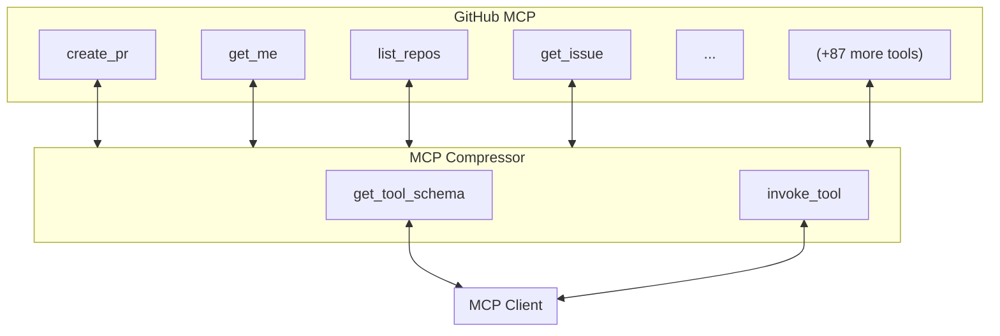
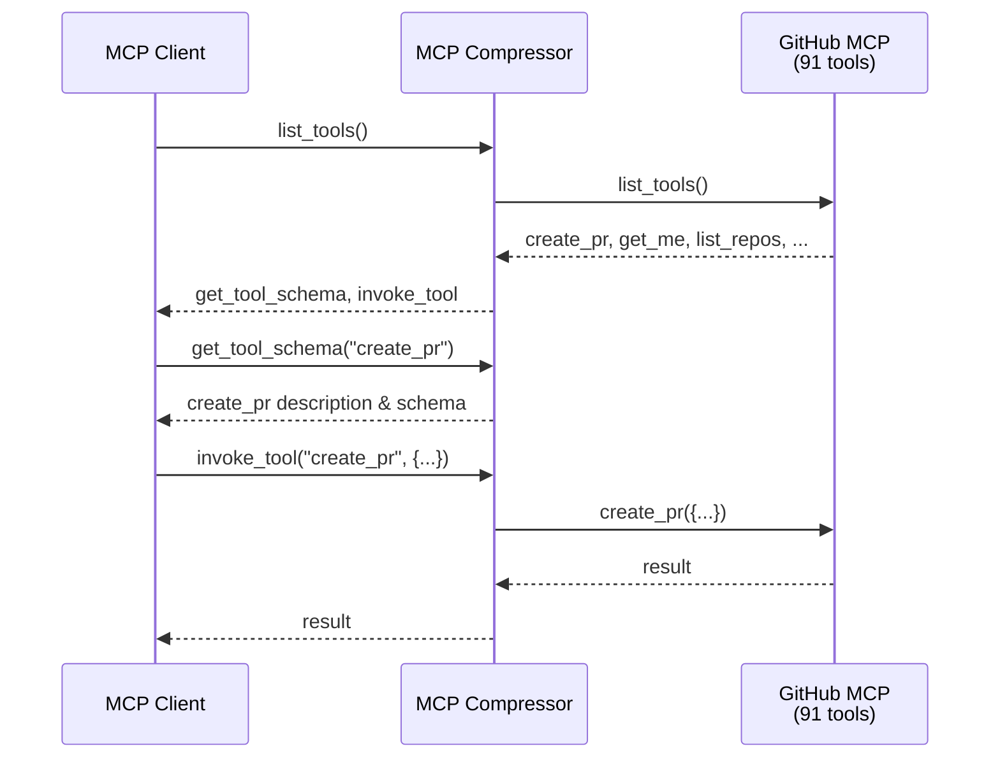

# mcp-compressor

[](https://img.shields.io/github/v/release/atlassian-labs/mcp-compressor)
[](https://github.com/atlassian-labs/mcp-compressor/actions/workflows/main.yml?query=branch%3Amain)
[](https://img.shields.io/github/commit-activity/m/atlassian-labs/mcp-compressor)
[](https://img.shields.io/github/license/atlassian-labs/mcp-compressor)

An MCP server wrapper for reducing tokens consumed by MCP tools.

- **Github repository**: <https://github.com/atlassian-labs/mcp-compressor/>
- **Documentation** <https://atlassian-labs.github.io/mcp-compressor/>
- **Blog** <https://www.atlassian.com/blog/developer/mcp-compression-preventing-tool-bloat-in-ai-agents />

---

## 📋 What's New

#### 2026-03-24 — CLI Mode

> `--cli-mode` — Converts any wrapped MCP server into a local CLI. Generates an executable shell
> script (Unix) or `.cmd` file (Windows) so agents and users can interact with the backend via
> familiar command-line conventions rather than structured tool calls.

#### 2026-03-24 — TOON Output

> `--toonify` — Automatically converts JSON responses from wrapped backend tools into
> [TOON format](https://github.com/toon-format/toon), a compact human- and LLM-readable alternative to JSON.

---

## Overview

MCP Compressor is a proxy server that wraps existing [Model Context Protocol (MCP)](https://modelcontextprotocol.io/) servers and compresses their tool descriptions to significantly reduce token consumption. Instead of exposing all tools with full schemas directly to language models, it provides a two-step interface:

1. **`get_tool_schema(tool_name)`** - Retrieve the full schema for a specific tool when needed
2. **`invoke_tool(tool_name, tool_input)`** - Execute a tool with the provided arguments

This approach dramatically reduces the number of tokens sent in the initial context while maintaining full functionality.

## Why?

MCP servers are exploding in popularity, but their tool descriptions consume significant tokens in every LLM request. For example:

- The official **GitHub MCP server** exposes 94 tools consuming **17,600 tokens**
- The official **Atlassian MCP server** consumes ~10,000 tokens

With 30k+ tokens just for tool descriptions, costs can reach **1-10 cents per request** depending on prompt caching. MCP Compressor solves this by replacing dozens of tools with just 2 wrapper tools, achieving **70-97% token reduction** while maintaining full functionality. This enables:

- Adding many MCP servers without blowing out context windows
- Significant cost savings on token-based API pricing
- Support for providing 100s or 1000s of tools across multiple servers to your agent

## Features

- **Token Reduction**: Compress tool descriptions by up to 99% depending on compression level and tool count
- **Multiple Compression Levels**: Choose between `low`, `medium`, `high`, or `max`
- **Universal Compatibility**: Works with any MCP server (stdio, HTTP, SSE)
- **TOON Output Conversion**: Optionally convert JSON backend tool results to [TOON](https://github.com/toon-format/spec) with `--toonify`
- **CLI Mode**: Convert any MCP server into a local CLI with `--cli-mode` — generates a shell script that lets you (or an AI agent) interact with the backend via familiar command-line syntax
- **Zero Functionality Loss**: All tools remain fully accessible through the wrapper interface
- **Easy Integration**: Drop-in replacement for existing MCP servers

## Installation

Install using pip or uv:

```bash
pip install mcp-compressor
# or
uv pip install mcp-compressor
```

## Quick Start

### Basic Usage

Wrap any MCP server by providing its command or URL:

```bash
# Wrap a stdio MCP server
uvx mcp-compressor uvx mcp-server-fetch

# Wrap a remote HTTP MCP server
uvx mcp-compressor https://example.com/server/mcp

# Wrap a remote SSE MCP server
uvx mcp-compressor https://example.com/server/sse
```

See `uvx mcp-compressor --help` for detailed documentation on available arguments.

### Compression Levels

Control how much compression to apply with the `--compression-level` or `-c` flag:

```bash
# Low
mcp-compressor uvx mcp-server-fetch -c low

# Medium (default)
mcp-compressor uvx mcp-server-fetch -c medium

# High
mcp-compressor uvx mcp-server-fetch -c high

# Max
mcp-compressor uvx mcp-server-fetch -c max
```

### Advanced Options

#### Stdio Servers

```bash
# Set working directory
mcp-compressor uvx mcp-server-fetch --cwd /path/to/dir

# Pass environment variables (supports environment variable expansion)
mcp-compressor uvx mcp-server-fetch \
  -e API_KEY=${MY_API_KEY} \
  -e DEBUG=true
```

#### Remote Servers (HTTP/SSE)

```bash
# Add custom headers
mcp-compressor https://api.example.com/mcp \
  -H "Authorization=Bearer ${TOKEN}" \
  -H "X-Custom-Header=value"

# Set timeout (default: 10 seconds)
mcp-compressor https://api.example.com/mcp \
  --timeout 30
```

#### Custom Server Names

When running multiple MCP servers through mcp-compressor, you can add custom prefixes to the wrapper tool names to avoid conflicts:

```bash
# Without server name - tools will be: get_tool_schema, invoke_tool
mcp-compressor uvx mcp-server-fetch

# With server name - tools will be: github_get_tool_schema, github_invoke_tool
mcp-compressor https://api.githubcopilot.com/mcp/ --server-name github

# Special characters are automatically sanitized
mcp-compressor uvx mcp-server-fetch --server-name "My Server!"
  # Results in: my_server__get_tool_schema, my_server__invoke_tool
```

#### TOON Output Conversion

Use `--toonify` to automatically convert JSON backend tool results into TOON format.

```bash
# Convert JSON backend tool results to TOON
mcp-compressor https://api.example.com/mcp --toonify
```

When `--toonify` is enabled:
- Successful backend tool results returned through direct tool calls are toonified if they are JSON objects or arrays
- Successful backend tool results returned through `invoke_tool(...)` are also toonified
- Wrapper responses from `get_tool_schema(...)` and `list_tools(...)` are never toonified
- Wrapper-generated guidance or error text from `invoke_tool(...)` is never toonified
- Non-JSON text is returned unchanged

#### CLI Mode

Use `--cli-mode` to turn any wrapped MCP server into a local CLI. This is useful when you want to interact with a backend server using familiar shell commands, or expose it to an AI agent as a CLI tool rather than a collection of MCP tools.

```bash
mcp-compressor https://mcp.atlassian.com/v1/mcp --server-name atlassian --cli-mode
```

When CLI mode starts, it:

1. Connects to the wrapped backend server (performing OAuth if required)
2. Starts a local HTTP bridge on `127.0.0.1:<random-port>`
3. Generates an executable script — on Unix, a Python3 script written to `~/.local/bin/<name>` (or the current directory if no candidate is on `PATH`); on Windows, a `.cmd` batch file written to a suitable directory on `PATH`
4. Exposes a single MCP tool `<server_name>_help` to the MCP client describing the CLI and its subcommands

The generated script forwards all arguments to the local bridge and prints the result. **The script only works while `mcp-compressor --cli-mode` is running.**

```bash
# Top-level help — lists all subcommands (one per backend tool)
atlassian --help

# Per-tool help — shows flags derived from the tool's JSON schema
atlassian get-confluence-page --help

# Invoke a tool — flags are automatically mapped to tool input
atlassian get-confluence-page --cloud-id abc123 --page-id 456

# Universal escape hatch for complex inputs
atlassian create-jira-issue --json '{"cloudId":"abc","projectKey":"PROJ","summary":"Bug"}'
```

CLI subcommand names are the snake_case → kebab-case conversion of the backend tool names (e.g. `getConfluencePage` → `get-confluence-page`).

`--toonify` is automatically enabled in CLI mode — all successful backend tool results are returned in TOON format.

Use `--cli-port` to pin the bridge to a specific port instead of a random one:

```bash
mcp-compressor https://mcp.atlassian.com/v1/mcp --server-name atlassian --cli-mode --cli-port 8765
```

#### Logging

```bash
# Set log level
mcp-compressor uvx mcp-server-fetch --log-level debug
mcp-compressor uvx mcp-server-fetch -l warning
```

## How It Works

The MCP Compressor acts as a transparent proxy between your LLM client and the underlying MCP server:



Instead of seeing all tools with full schemas (which are often thousands of tokens), the LLM sees just:

```
Available tools:
<tool>search_web(query, max_results): Search the web for information</tool>
<tool>get_weather(location, units): Get current weather for a location</tool>
<tool>send_email(to, subject, body): Send an email message</tool>
```

When the LLM needs to use a tool, it first calls `get_tool_schema(tool_name)` to retrieve the full schema, then `invoke_tool(tool_name, tool_input)` to execute it.

If `--toonify` is enabled, successful backend tool results are converted from JSON to TOON before being returned to the client. The wrapper helper responses themselves are not reformatted.

In CLI mode (`--cli-mode`), the compressor exposes a single `<server_name>_help` tool instead of the usual wrappers. All actual tool interaction happens through the generated shell script via a local HTTP bridge.



## Compression Level Details

| Level | Description | Use Case |
|-------|-------------|----------|
| `max` | Maximum compression - exposes `list_tools()` function | Maximum token savings. Good for (1) MCP servers you want to provide to your agent but expect tools to be used rarely and (2) for servers with a very large number of tools |
| `high` | Only tool name and parameter names | Maximum token savings, best for large toolsets |
| `medium` (default) | First sentence of each description | Balanced approach, good for most cases. |
| `low` | Complete tool descriptions | For tools that are unusual and not intuitive for the agent to understand and use. Using a lower level of compression in these cases provides more context to the LLM on the purpose of the tools and how they relate to each other. |

The best choice of compression level will depend on a number of factors, including:

1. **The number of tools in the MCP server** - more tools, use more compression.
1. **How frequently the tools are expected to be used** - if tools from a compressed server are rarely used, compress them more to prevent eating up tokens for nothing.
1. **How unusual or complex the tools are** - simpler tools can be compressed more heavily with little downsize. Consider a simple `bash` tool with a single input argument `command`. Any modern LLM will understand exactly how to use it after seeing just the tool name and the name of the argument, so unless there is unexpected internal logic within the tool, aggressive compression can be used with little downside.

## Configuration with MCP JSON file

To configure mcp-compressor in an MCP JSON configuration file, use the following pattern:

```json
{
  "mcpServers": {
    "compressed-github": {
      "command": "mcp-compressor",
      "args": [
        "https://api.githubcopilot.com/mcp/",
        "--header",
        "Authorization=Bearer ${GH_PAT}",
        "--server-name",
        "github"
      ],
    },
    "compressed-fetch": {
      "command": "mcp-compressor",
      "args": [
        "uvx",
        "mcp-server-fetch",
        "--server-name",
        "fetch"
      ],
    }
  }
}
```

This configuration will create tools named `github_get_tool_schema`, `github_invoke_tool`, `fetch_get_tool_schema`, and `fetch_invoke_tool`, preventing naming conflicts when multiple compressed servers are used together.

With compression level:

```json
{
  "mcpServers": {
    "compressed-fetch": {
      "command": "mcp-compressor",
      "args": [
        "uvx",
        "mcp-server-fetch",
        "--compression-level", "high"
      ],
    }
  }
}
```

## Use Cases

- **Large Toolsets**: When your MCP server exposes dozens or hundreds of tools
- **Token-Limited Models**: Maximize available context window for actual conversation
- **Cost Optimization**: Reduce token costs for pay-per-token API usage
- **Performance**: Faster initial responses with smaller context
- **Multi-Server Setups**: Use with multiple MCP servers without overwhelming the context

## Command-Line Reference

```
Usage: mcp-compressor [OPTIONS] COMMAND_OR_URL

  Run the MCP Compressor proxy server.

  This is the main entry point for the CLI application. It connects to an MCP
  server (via stdio, HTTP, or SSE) and wraps it with a compressed tool
  interface.

Arguments:
  COMMAND_OR_URL  The URL of the MCP server to connect to for streamable HTTP
                  or SSE servers, or the command and arguments to run for
                  stdio servers. Example: uvx mcp-server-fetch  \[required]

Options:
  --cwd TEXT                      The working directory to use when running
                                  stdio MCP servers.
  -e, --env TEXT                  Environment variables to set when running
                                  stdio MCP servers, in the form
                                  VAR_NAME=VALUE. Can be used multiple times.
                                  Supports environment variable expansion with
                                  ${VAR_NAME} syntax.
  -H, --header TEXT               Headers to use for remote (HTTP/SSE) MCP
                                  server connections, in the form Header-
                                  Name=Header-Value. Can be use multiple
                                  times. Supports environment variable
                                  expansion with ${VAR_NAME} syntax.
  -t, --timeout FLOAT             The timeout in seconds for connecting to the
                                  MCP server and making requests.  \[default:
                                  10.0]
  -c, --compression-level [max|high|medium|low]
                                  The level of compression to apply to tool
                                  the tools descriptions of the wrapped MCP
                                  server.  \[default: medium]
  -n, --server-name TEXT          Optional custom name to prefix the wrapper
                                  tool names (get_tool_schema, invoke_tool,
                                  list_tools). The name will be sanitized to
                                  conform to MCP tool name specifications
                                  (only A-Z, a-z, 0-9, _, -, .).
  -l, --log-level [debug|info|warning|error|critical]
                                  The logging level. Used for both the MCP
                                  Compressor server and the underlying MCP
                                  server if it is a stdio server.  \[default:
                                  WARNING]
  --toonify                       Convert JSON backend tool responses to TOON
                                  format automatically.
  --cli-mode                      Start in CLI mode: expose a single help MCP
                                  tool, start a local HTTP bridge, and generate
                                  a shell script for interacting with the
                                  wrapped server via CLI. --toonify is
                                  automatically enabled in this mode.
  --cli-port INTEGER              Port for the local CLI bridge HTTP server
                                  (default: random free port).
  --install-completion            Install completion for the current shell.
  --show-completion               Show completion for the current shell, to
                                  copy it or customize the installation.
  --help                          Show this message and exit.
```
