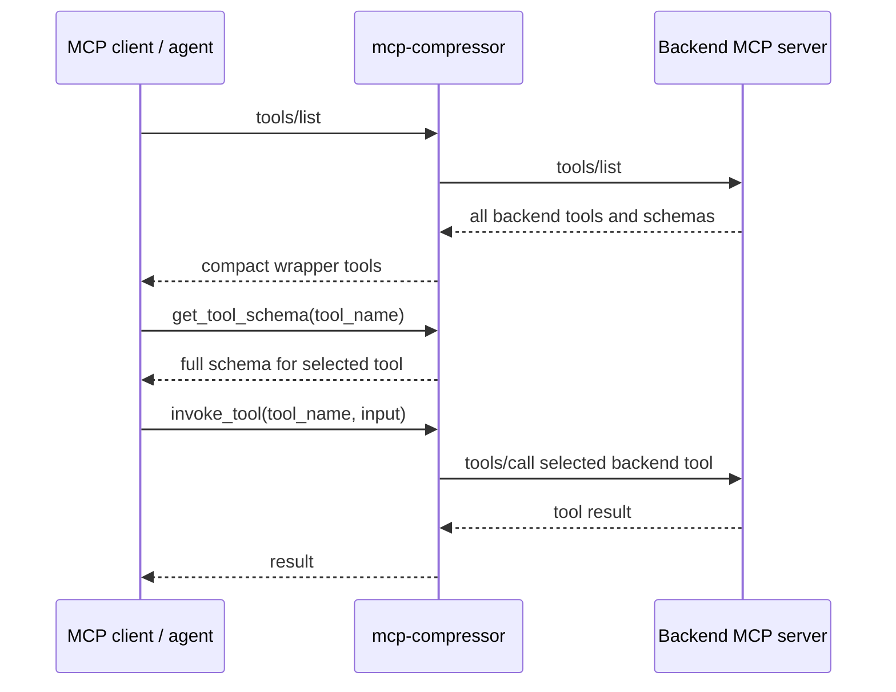
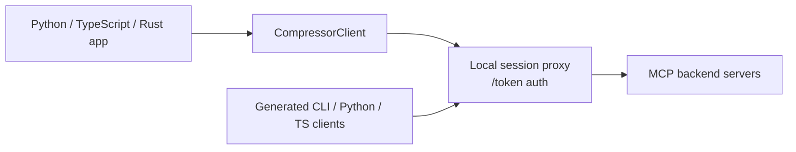

# mcp-compressor

[](https://github.com/atlassian-labs/mcp-compressor/releases)
[](https://github.com/atlassian-labs/mcp-compressor/actions/workflows/main.yml?query=branch%3Amain)
[](https://github.com/atlassian-labs/mcp-compressor/commits/main)
[](https://github.com/atlassian-labs/mcp-compressor/blob/main/LICENSE)

`mcp-compressor` helps agents use large MCP servers without spending huge amounts of context on tool descriptions and schemas.

It can run as a CLI MCP proxy, or be embedded directly from Python, TypeScript, or Rust.

- **Documentation**: <https://atlassian-labs.github.io/mcp-compressor/>
- **Repository**: <https://github.com/atlassian-labs/mcp-compressor/>
- **Blog**: <https://www.atlassian.com/blog/developer/mcp-compression-preventing-tool-bloat-in-ai-agents/>

## Why mcp-compressor?

A powerful MCP server can expose dozens or hundreds of tools. Each tool has a name, description, input schema, and sometimes large nested JSON Schema details. Sending all of that to a model up front can waste thousands of tokens before the agent has done any useful work.

For example, large public MCP servers can spend thousands or tens of thousands of tokens on tool descriptions alone. That creates three problems:

- models spend context on tools they may never call,
- cost increases for every request that carries the tool list,
- adding multiple MCP servers quickly overwhelms practical context budgets.

`mcp-compressor` changes the interaction pattern: the model sees a small compressed surface first, asks for the full schema only for the selected tool, and then invokes that tool.

## Pattern 1: compressed MCP proxy

Use this when you want any MCP client to see a smaller tool surface.



The frontend usually exposes only:

- `get_tool_schema`
- `invoke_tool`
- optionally `list_tools` at `max` compression

## Pattern 2: local proxy for SDKs and generated clients

Use this when your application wants to embed compression directly and call tools from code or shell commands.



The SDK starts a local session proxy for generated clients. Generated clients call that proxy using a session token. Your app does **not** need to spawn a `mcp-compressor` stdio subprocess.

## Features

- [Compressed MCP proxy](https://atlassian-labs.github.io/mcp-compressor/usage/cli/#standard-mcp-proxy) for existing MCP clients.
- [Compression levels](https://atlassian-labs.github.io/mcp-compressor/concepts/how-it-works/#compression-levels): `low`, `medium`, `high`, `max`.
- [Python, TypeScript, and Rust SDKs](https://atlassian-labs.github.io/mcp-compressor/usage/sdks/) with aligned `CompressorClient` APIs.
- [Local TypeScript tool compression](https://atlassian-labs.github.io/mcp-compressor/usage/sdks/#compress-local-typescript-tools) for AI SDK-style in-process tools.
- [CLI Mode and Code Mode generated clients](https://atlassian-labs.github.io/mcp-compressor/usage/generated-clients/): shell commands plus Python/TypeScript functions.
- [Just Bash integration](https://atlassian-labs.github.io/mcp-compressor/usage/just-bash/) for command-oriented agents.
- [Remote streamable HTTP MCP backends](https://atlassian-labs.github.io/mcp-compressor/usage/auth-and-remote/).
- [OAuth support](https://atlassian-labs.github.io/mcp-compressor/usage/auth-and-remote/#native-oauth) for providers that support browser authorization.
- [Tool filters and TOON output](https://atlassian-labs.github.io/mcp-compressor/concepts/configuration/#filters) to further reduce context.
- [Atlassian MCP example](https://atlassian-labs.github.io/mcp-compressor/examples/atlassian/) with OAuth-first usage.

## Quick example

=== "CLI"

    ```bash
    mcp-compressor -c medium -- python server.py
    ```

=== "Python"

    ```python
    from mcp_compressor import CompressorClient

    with CompressorClient(
        servers={"alpha": {"command": "python", "args": ["server.py"]}},
        compression_level="medium",
    ) as proxy:
        print([tool.name for tool in proxy.tools])
        print(proxy.invoke("echo", {"message": "hello"}))
    ```

=== "TypeScript"

    ```ts
    import { CompressorClient } from "@atlassian/mcp-compressor";

    const proxy = await new CompressorClient({
      servers: { alpha: { command: "python", args: ["server.py"] } },
      compressionLevel: "medium",
    }).connect();

    try {
      console.log(proxy.tools.map((tool) => tool.name));
      console.log(await proxy.invoke("echo", { message: "hello" }));
    } finally {
      proxy.close();
    }
    ```

=== "Rust"

    ```rust
    use mcp_compressor::compression::CompressionLevel;
    use mcp_compressor::sdk::{CompressorClient, ServerConfig};
    use serde_json::json;

    let proxy = CompressorClient::builder()
        .server("alpha", ServerConfig::command("python").arg("server.py"))
        .compression_level(CompressionLevel::Medium)
        .build()
        .connect()
        .await?;

    let result = proxy.invoke("echo", json!({ "message": "hello" })).await?;
    ```

## Generated clients

**CLI Mode** generates shell commands:

```bash
mcp-compressor --cli-mode --server-name atlassian -- https://mcp.atlassian.com/v1/mcp
atlassian get-accessible-atlassian-resources
```

**Code Mode** generates Python or TypeScript functions:

```python
# generated-py/atlassian.py
import atlassian

resources = atlassian.getAccessibleAtlassianResources()
```

```ts
import { getAccessibleAtlassianResources } from "./generated-ts/atlassian.ts";

const resources = await getAccessibleAtlassianResources();
```

See [Code Mode and generated clients](https://atlassian-labs.github.io/mcp-compressor/usage/generated-clients/) for more detail.

## Where to go next

1. [Install the package you need](https://atlassian-labs.github.io/mcp-compressor/getting-started/installation/).
2. Run the [quickstart](https://atlassian-labs.github.io/mcp-compressor/getting-started/quickstart/).
3. Read [how compression works](https://atlassian-labs.github.io/mcp-compressor/concepts/how-it-works/).
4. Choose between [CLI usage](https://atlassian-labs.github.io/mcp-compressor/usage/cli/), [SDK usage](https://atlassian-labs.github.io/mcp-compressor/usage/sdks/), [generated clients](https://atlassian-labs.github.io/mcp-compressor/usage/generated-clients/), and [Just Bash](https://atlassian-labs.github.io/mcp-compressor/usage/just-bash/).
