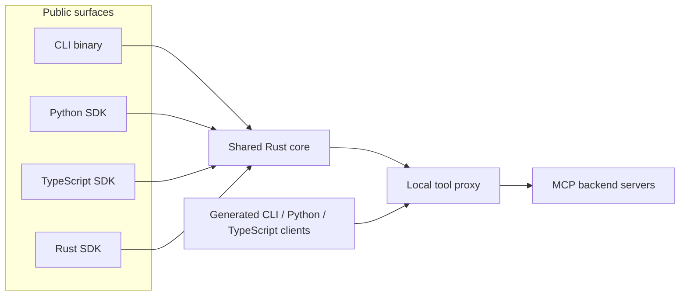
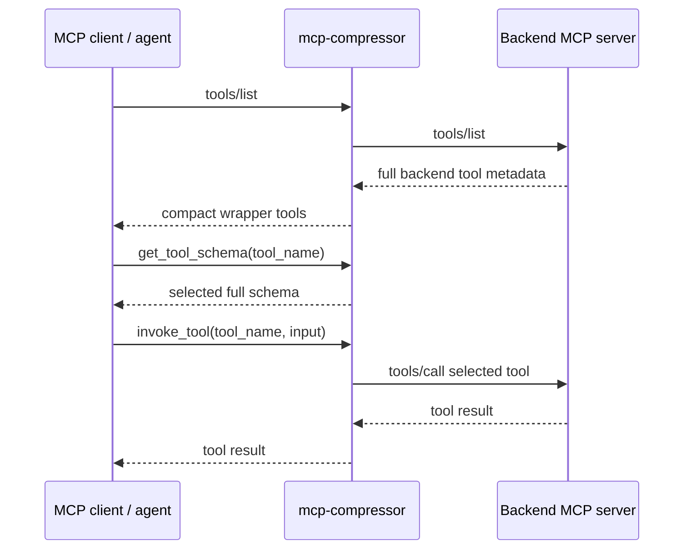

# Architecture

`mcp-compressor` is a shared Rust implementation with public CLI, Python, TypeScript, and Rust SDK surfaces.

The core design goal is consistency: compression, tool routing, generated clients, auth behavior, and proxy semantics should work the same way regardless of which language a user chooses.

## Package layout

```text
crates/
  mcp-compressor/          # public Rust crate and public `mcp-compressor` binary target
  mcp-compressor-core/     # shared Rust implementation used by every package surface
  mcp-compressor-python/   # PyO3 extension crate for the Python package
  mcp-compressor-node/     # napi-rs extension crate for the TypeScript package
python/
  mcp-compressor/          # Python package exposing `mcp_compressor`
typescript/                # TypeScript package `@atlassian/mcp-compressor`
docs/                      # public documentation
```

## Runtime architecture



The public surfaces are thin wrappers around shared Rust behavior:

- the CLI is a direct Rust binary,
- the Python package calls Rust through PyO3,
- the TypeScript package calls Rust through napi-rs,
- the Rust crate exposes the same high-level SDK concepts directly.

## Compression model

For standard MCP compression, the backend server may expose many tools, but the frontend compressor exposes a small wrapper surface:

- `get_tool_schema`
- `invoke_tool`
- optionally `list_tools` at `max` compression



Compression levels control how much backend metadata is included in wrapper descriptions:

| Level | Frontend behavior |
|---|---|
| `low` | Tool names, arguments, and full descriptions in the wrapper description. |
| `medium` | Tool names, arguments, and shortened first-line descriptions. |
| `high` | Tool names and argument names only. |
| `max` | Minimal wrappers; agents call `list_tools` / `get_tool_schema` on demand. |

## SDK sessions

The SDKs use the same core session model:

1. configure one or more backend MCP servers,
2. connect a `CompressorClient`,
3. receive a `CompressorProxy`,
4. list compressed tools, inspect schemas, invoke tools, or write generated clients.

The local proxy is protected by a bearer token generated per session. Generated clients call the local proxy and therefore only work while the owning session is alive.

## Generated clients

Generated clients are small wrappers around the live local proxy:

- **CLI Mode** writes shell commands.
- **Code Mode** writes Python or TypeScript modules.
- **Just Bash** exposes provider metadata that language hosts can install into an existing Just Bash instance.

The generated files do not embed backend credentials. They call the session proxy with a short-lived local token.

## Remote backends and auth

Remote streamable HTTP MCP backends are supported directly. Authentication options include:

- native OAuth with local loopback callback handling,
- explicit backend headers after `--` in the CLI,
- SDK dynamic auth providers that refresh headers per backend HTTP request.

The CLI and SDKs keep backend connection details separate from frontend compression options.

## Local TypeScript tool compression

TypeScript also supports compressing in-process tools with `compressTools`. This path does not start an MCP server or proxy. It converts local tool functions into the same compressed `get_tool_schema` / `invoke_tool` wrapper shape and can then adapt them to AI SDK or Mastra tools.

## Release artifacts

The project publishes three public package surfaces:

- Rust crate and binary: `mcp-compressor`
- Python package: `mcp-compressor`, import `mcp_compressor`
- TypeScript package: `@atlassian/mcp-compressor`

Release workflows derive package versions from GitHub release tags.
