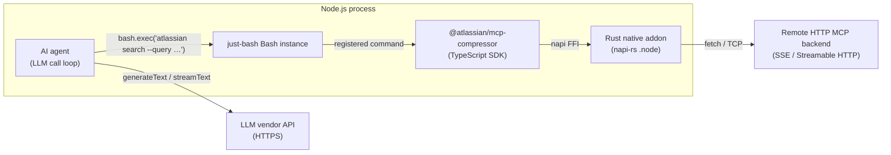
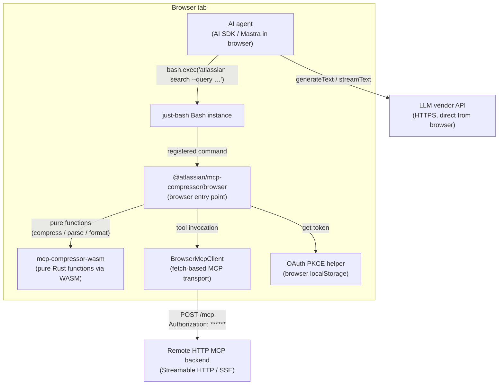
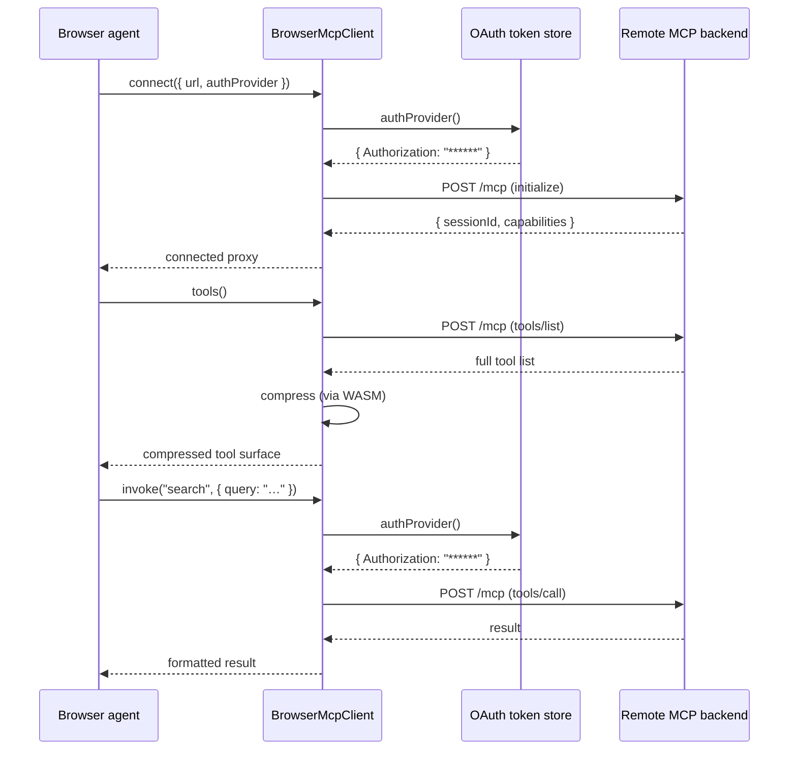
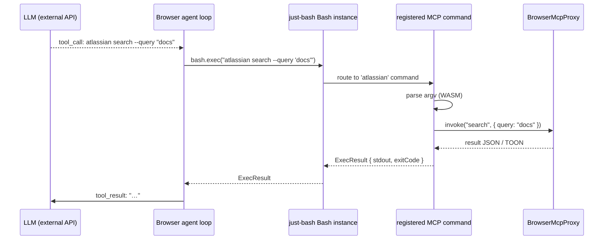
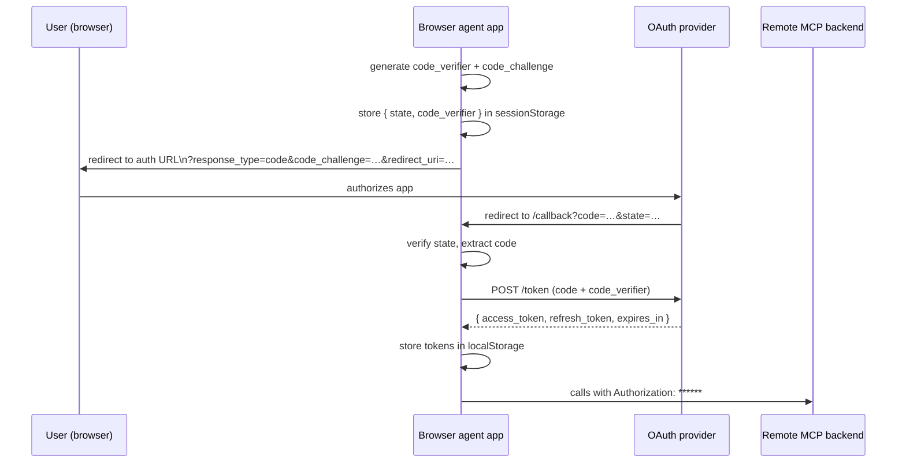
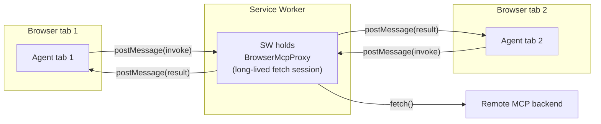
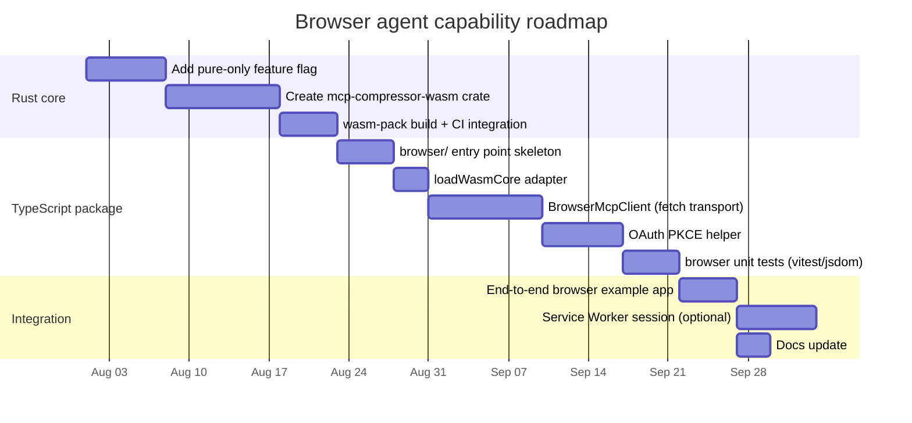

# Design: browser-only agents with just-bash CLI mode

!!! info "Implementation status"
    **Exploratory design.** This document describes a proposed architecture for running
    `mcp-compressor` just-bash CLI mode inside a browser-only AI agent. None of the
    browser-specific components described here are implemented yet. The existing
    Node.js SDK, CLI, and server-side SDKs are unaffected by this design.

This document describes how `mcp-compressor`'s just-bash CLI mode SDK could provide
MCP tools to an AI agent running entirely in a browser — except for calls to an external
LLM vendor API.

The core challenge is that the current TypeScript SDK delegates nearly all behaviour to a
Rust native addon built with napi-rs. That `.node` native module does not load in a
browser. The path to a browser-capable SDK runs through WebAssembly.

---

## Background: what just-bash CLI mode provides today

In Node.js (server-side or Electron), the just-bash SDK lets you connect to one or more
MCP backends, compress their tool surfaces, and install them as shell-style commands
inside a [`just-bash`](https://github.com/nicolo-ribaudo/just-bash) `Bash` instance.



The just-bash commands appear to the agent as ordinary shell invocations. The Rust core
handles compression, argument parsing, schema formatting, OAuth, and backend transport.

---

## Constraints in a browser environment

| Capability | Node.js | Browser |
|---|---|---|
| napi-rs native addon | ✅ | ❌ no native modules |
| Spawn subprocess MCP servers | ✅ | ❌ no child processes |
| Remote HTTP MCP (fetch) | ✅ | ✅ with CORS headers |
| WebAssembly (WASM) | ✅ | ✅ |
| Local filesystem | ✅ | ❌ (no generated file writes) |
| OAuth loopback redirect | ✅ | ❌ (no loopback server) |
| OAuth PKCE in-page redirect | — | ✅ |
| Service Worker | — | ✅ |
| Tokio async runtime | ✅ | ❌ |

In short: a browser agent can call remote HTTP MCP servers with `fetch()`, run pure
computation in WASM, and authenticate with OAuth PKCE. It cannot start subprocess MCP
servers, load native modules, or open a loopback callback server.

---

## Proposed overall architecture



The design splits the Rust core into two halves:

- **Pure half** — compression formatting, argument parsing, schema rendering, tool listing.
  All stateless, no I/O. Compiled to WASM and called directly from the browser.
- **Transport half** — MCP session management, backend connections, OAuth callbacks.
  Stays in the existing Rust binary/Node.js path. In the browser this half is replaced by
  a TypeScript `BrowserMcpClient` that uses `fetch()`.

---

## Component 1: `mcp-compressor-wasm` crate

A new sibling crate to `mcp-compressor-node` that wraps the same pure FFI layer
(`crates/mcp-compressor-core/src/ffi/pure.rs`) but targets WebAssembly using
[`wasm-bindgen`](https://rustwasm.github.io/wasm-bindgen/) instead of napi-rs.

### Functions to expose

```rust
// crates/mcp-compressor-wasm/src/lib.rs  (sketch)
use wasm_bindgen::prelude::*;
use mcp_compressor::ffi::pure;

#[wasm_bindgen]
pub fn compress_tool_listing_json(level: &str, tools_json: &str) -> Result<String, JsError> { … }

#[wasm_bindgen]
pub fn format_tool_schema_response_json(tool_json: &str) -> Result<String, JsError> { … }

#[wasm_bindgen]
pub fn parse_tool_argv_json(tool_json: &str, argv_json: &str) -> Result<String, JsError> { … }

#[wasm_bindgen]
pub fn render_cli_top_level_help_json(command: &str, cli_name: &str, tools_json: &str) -> Result<String, JsError> { … }

#[wasm_bindgen]
pub fn render_cli_subcommand_help_json(cli_name: &str, tool_json: &str) -> Result<String, JsError> { … }
```

This surface matches the napi binding's `NativeCore` interface so that the TypeScript
layer can swap implementations at runtime.

### Cargo feature flags

The Rust core currently pulls in Tokio, axum, reqwest, rmcp, and other system-level
crates. None of these compile to `wasm32-unknown-unknown`. The core crate needs
`default-features = false` with a feature flag such as `pure-only` that excludes:

- `tokio` (async runtime)
- `axum` (HTTP server)
- `reqwest` (HTTP client)
- `rmcp` (MCP SDK)
- `libc`, `fs2`, `open` (OS-level crates)
- `flate2`, `tar`, `zip` (artifact packaging)

The pure functions (`compression`, `cli/parser`, `cli/help`, `ffi/pure`, `ffi/dto`) have
no OS dependencies and compile cleanly.

### Build

```bash
# Install wasm-pack once
cargo install wasm-pack

# Build browser-targeted WASM package
wasm-pack build crates/mcp-compressor-wasm \
  --target web \
  --out-dir ../../typescript/wasm-browser \
  --no-default-features \
  --features pure-only
```

`wasm-pack` outputs:
- `mcp_compressor_wasm_bg.wasm` — the compiled binary
- `mcp_compressor_wasm.js` — JS glue
- TypeScript declarations (`.d.ts`)

### Interface adapter

The TypeScript SDK's `native.ts` currently calls `loadNativeCore()` which requires the
napi-rs addon. The browser entry point provides a drop-in alternative that loads the WASM
package and wraps it behind the same `NativeCore` interface:

```ts
// typescript/src/browser/native_wasm.ts  (sketch)
import init, * as wasmCore from "../../wasm-browser/mcp_compressor_wasm.js";

let initialized = false;

export async function loadWasmCore(): Promise<NativeCore> {
  if (!initialized) {
    await init();
    initialized = true;
  }
  return {
    compressToolListingJson: wasmCore.compress_tool_listing_json,
    formatToolSchemaResponseJson: wasmCore.format_tool_schema_response_json,
    parseToolArgvJson: wasmCore.parse_tool_argv_json,
    renderCliTopLevelHelpJson: wasmCore.render_cli_top_level_help_json,
    renderCliSubcommandHelpJson: wasmCore.render_cli_subcommand_help_json,
    // Session management — provided by BrowserMcpClient instead:
    startCompressedSessionJson: notSupported("startCompressedSessionJson"),
    // … rest stubbed or not exposed
  };
}
```

---

## Component 2: `BrowserMcpClient`

The Rust core's session management (`startCompressedSession`, the local proxy, backend
connections) is replaced by a TypeScript class that speaks the
[MCP Streamable HTTP transport](https://spec.modelcontextprotocol.io/specification/2025-03-26/basic/transports/)
directly using `fetch()`.

### MCP over fetch — sequence diagram



### Sketch

```ts
// typescript/src/browser/browser_mcp_client.ts  (sketch)
export interface BrowserMcpClientOptions {
  url: string;
  authProvider?: () => Promise<Record<string, string>>;
  compressionLevel?: CompressionLevel;
  includeTools?: string[];
  excludeTools?: string[];
}

export class BrowserMcpClient {
  async connect(): Promise<BrowserMcpProxy> { … }
}

export class BrowserMcpProxy {
  /** Compressed tool listing, fetched once and cached. */
  get tools(): ProxyTool[] { … }

  /** Invoke a backend tool by name. */
  async invoke(toolName: string, input: Record<string, unknown>): Promise<string> { … }

  /** Install all tools as just-bash commands on a Bash instance. */
  installJustBashCommands(bash: Bash): void { … }
}
```

### CORS requirement

Browsers enforce CORS. The remote MCP server must respond to preflight `OPTIONS` requests
with appropriate headers:

```http
Access-Control-Allow-Origin: *
Access-Control-Allow-Methods: POST, GET, OPTIONS
Access-Control-Allow-Headers: Authorization, Content-Type, Mcp-Session-Id
```

Atlassian's hosted MCP server already supports this for authorized origins. Self-hosted
backends may need a CORS-aware reverse proxy (nginx, Cloudflare Worker, etc.) in front of
them. This is an operational concern, not a library concern.

---

## Component 3: just-bash browser integration

[`just-bash`](https://github.com/nicolo-ribaudo/just-bash) implements a shell-like command
execution environment in pure JavaScript. It ships as an ESM npm package with no
Node.js-specific dependencies, making it browser-compatible when bundled with a modern
bundler (Vite, esbuild, webpack).

The existing `createJustBashCommandRegistrations` and `installJustBashRegistrations`
functions in `just_bash_commands.ts` are already pure TypeScript with no Node.js
dependencies. They work in a browser as-is once the WASM layer provides the pure
functions they depend on (`renderCliTopLevelHelpJson`, `renderCliSubcommandHelpJson`,
`parseToolArgvJson`).

The `BrowserMcpProxy.installJustBashCommands(bash)` method calls these existing helpers
and adds all compressed backend tools as just-bash commands.

### Command lifecycle in a browser agent



### Piping and TOON support

The existing `createPipingHintPlugin` (AST transform for `MCP_TOONIFY`) operates on
just-bash's parsed AST and is pure TypeScript. It works in the browser without changes.

---

## Component 4: OAuth PKCE in the browser

The current Rust OAuth flow opens a local loopback callback server (`127.0.0.1:PORT`)
that cannot exist in a browser. The browser alternative is OAuth
[Authorization Code + PKCE](https://datatracker.ietf.org/doc/html/rfc7636), redirecting
back to the app's own origin.



The `authProvider` function passed to `BrowserMcpClient` reads the stored token (and
silently refreshes it if expired):

```ts
const authProvider = async () => {
  const token = await tokenStore.currentAccessToken(); // reads localStorage, refreshes if needed
  return { Authorization: `****** };
};

const client = new BrowserMcpClient({
  url: "https://mcp.atlassian.com/v1/mcp",
  authProvider,
});
```

The app page at the redirect URI calls a `handleOAuthCallback()` helper on load to
complete the exchange and store the tokens before redirecting back to the agent view.

---

## Component 5: Service Worker session (optional, advanced)

For single-page applications that want to persist a compressed MCP session across
navigation events, or share it across multiple agent tabs, a Service Worker can hold the
`BrowserMcpProxy` and expose it via `postMessage` or `BroadcastChannel`.



This is an optional optimisation. It avoids re-connecting to the MCP backend on every
page load and amortises the OAuth token refresh across tabs. It is not required for the
basic just-bash browser agent pattern.

---

## Browser entry point

The browser entry point re-exports the browser-compatible subset of the package and wires
up the WASM loader:

```ts
// typescript/src/browser/index.ts  (sketch)
export { BrowserMcpClient, BrowserMcpProxy } from "./browser_mcp_client.js";
export { loadWasmCore } from "./native_wasm.js";
export { handleOAuthCallback, createAuthProvider } from "./oauth_pkce.js";

// Re-export pure TS helpers that work in browser unchanged:
export { compressTools } from "../local_tools.js";
export { toAISDKTools, toMastraTools } from "../adapters.js";
export {
  createJustBashCommandRegistrations,
  installJustBashRegistrations,
} from "../just_bash_commands.js";
export { createPipingHintPlugin, installPipingHintPlugin } from "../just_bash_transform.js";
```

The package.json `exports` map gains a `./browser` entry:

```json
"./browser": {
  "import": "./dist/browser/index.js",
  "types": "./dist/browser/index.d.ts"
}
```

Node.js consumers keep their existing imports; browser consumers add `/browser`.

---

## End-to-end example

```ts
import { BrowserMcpClient, createAuthProvider, handleOAuthCallback } from "@atlassian/mcp-compressor/browser";
import { Bash } from "just-bash";
import { generateText } from "ai";
import { anthropic } from "@ai-sdk/anthropic";

// 1. On the OAuth callback page, complete the token exchange.
await handleOAuthCallback();

// 2. Build an auth provider that reads from localStorage.
const authProvider = createAuthProvider("atlassian");

// 3. Connect to the remote MCP backend.
const proxy = await new BrowserMcpClient({
  url: "https://mcp.atlassian.com/v1/mcp",
  authProvider,
  compressionLevel: "medium",
}).connect();

// 4. Install MCP tools as just-bash commands.
const bash = new Bash({ customCommands: [] });
proxy.installJustBashCommands(bash);

// 5. Run the agent loop.
//    The LLM issues just-bash commands; the agent executes them and feeds
//    results back. All MCP calls go through fetch(); LLM calls go to
//    Anthropic's API — both are HTTPS from the browser.
await generateText({
  model: anthropic("claude-opus-4-5"),
  tools: {
    bash: {
      description: proxy.tools.map((t) => t.description).join("\n"),
      parameters: { /* … */ },
      execute: async ({ command }) => {
        const result = await bash.exec(command);
        return result.stdout || result.stderr;
      },
    },
  },
  prompt: "Find recent Confluence pages about the Q3 roadmap.",
});
```

---

## What works today vs. what requires new work

```mermaid
block-beta
  columns 2

  block:today["Works today (Node.js only)"]:1
    A["CompressorClient / CompressorProxy"]
    B["installJustBashCommands\ninstallPipingHintPlugin"]
    C["compressTools (local tools)"]
    D["toAISDKTools / toMastraTools"]
    E["OAuth (loopback callback)"]
  end

  block:new["Needs new work for browser"]:1
    F["mcp-compressor-wasm crate\n(wasm-bindgen, pure-only feature)"]
    G["BrowserMcpClient\n(fetch-based MCP transport)"]
    H["browser/ package entry point\n(./browser exports)"]
    I["OAuth PKCE helper\n(browser redirect flow)"]
    J["core Cargo feature flags\n(no-tokio / pure-only)"]
  end
```



---

## Key design decisions and tradeoffs

### Only remote HTTP MCP backends

Browser agents can only reach backends that expose a Streamable HTTP or SSE MCP endpoint
accessible by `fetch()`. There is no way to start a subprocess (`python server.py`) from
a browser page. Teams that want to expose a local Python or Node.js MCP server to a
browser agent must run a small bridge server (e.g. a local dev server with CORS enabled)
or a cloud-hosted MCP endpoint.

### WASM pure-only surface

The WASM crate exposes only the pure computation functions. It does not provide a full
`CompressorClient`-equivalent in WASM because the backend transport (MCP session lifecycle,
OAuth callbacks) is fundamentally different in a browser. The browser entry point composes
the WASM pure layer with a TypeScript transport layer rather than trying to replicate the
full Rust session model.

### No generated file writes

The `writeClient()` / `writeCodeClient()` API writes files to disk — this is not possible
in a browser. The browser just-bash mode is always "in-memory": commands are registered
directly on the `Bash` instance rather than generating shell scripts or Python modules.

### Token security

OAuth tokens stored in `localStorage` are accessible to any JS on the page. For
production use, prefer `sessionStorage` (cleared on tab close) or storing tokens in the
Service Worker memory (not accessible from the page at all). The design does not mandate
a specific storage policy; `createAuthProvider` accepts a pluggable `tokenStore`.

### Bundle size

`wasm-pack --target web` produces a `.wasm` binary. The pure compression functions are
lightweight Rust (string formatting, JSON parsing, pattern matching). With `wasm-opt` and
`lto = true`, expect the WASM binary to be roughly 300–600 KB before Brotli compression
(~100–200 KB over the wire). This is acceptable for a browser application that benefits
from MCP tool access.

---

## Implementation roadmap



### Phase 1 — pure WASM crate

1. Add a `pure-only` (or `no-runtime`) Cargo feature to `mcp-compressor-core` that
   excludes all I/O dependencies.
2. Create `crates/mcp-compressor-wasm` with `wasm-bindgen` exports of the five pure FFI
   functions.
3. Add `wasm-pack build` to the CI matrix and publish the WASM package to npm as
   `@atlassian/mcp-compressor-wasm` (or bundle it inside the main package).

### Phase 2 — browser TypeScript layer

4. Add `typescript/src/browser/` directory with `loadWasmCore`, `BrowserMcpClient`,
   `BrowserMcpProxy`, and `handleOAuthCallback` / `createAuthProvider`.
5. Add `./browser` export to `package.json`.
6. Write unit tests using `vitest` with jsdom or a lightweight WASM test runner.

### Phase 3 — integration and example

7. Build a minimal example app (Vite SPA) that connects to a real remote MCP backend,
   installs just-bash commands, and runs a simple agent loop.
8. Optionally add Service Worker session support.
9. Update docs with browser-specific usage guide.
