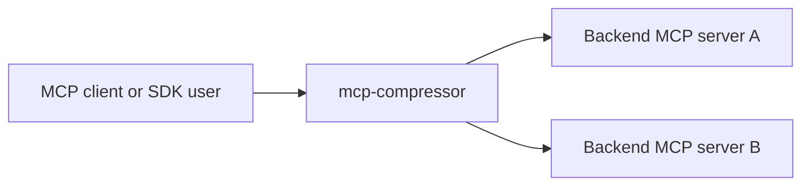

# How it works

`mcp-compressor` sits between an MCP client and one or more backend MCP servers.



The compressor connects to backend servers, reads their tool metadata, and exposes a smaller frontend tool surface.

## Normal compressed tools

Instead of exposing every backend tool directly, the frontend exposes wrappers such as:

- `<server>_get_tool_schema`
- `<server>_invoke_tool`
- `<server>_list_tools` at `max` compression

For a single server named `atlassian`, the client might see:

```text
atlassian_get_tool_schema
atlassian_invoke_tool
atlassian_list_tools
```

A model can first inspect the compact listing, then call `get_tool_schema` only for the tool it wants, then call `invoke_tool`.

When there is exactly one backend server and no explicit `--server-name`, the wrapper tools are exposed without a prefix:

```text
get_tool_schema
invoke_tool
```

## Compression levels

| Level | Tool listing format | Description included |
|---|---|---|
| `low` | `<tool>name(arg1, arg2): Full description</tool>` | Full description text |
| `medium` | `<tool>name(arg1, arg2): First sentence</tool>` | First line of description, up to the first `.` |
| `high` | `<tool>name(arg1, arg2)</tool>` | None |
| `max` | `<tool>name</tool>` | None; a `list_tools` frontend tool is also added |

The default level is `medium`.

### Schema response format

When a model calls `get_tool_schema`, it always receives the full tool description and complete JSON Schema, regardless of the active compression level:

```text
<tool>toolName(arg1, arg2): Full description of the tool</tool>

{
  "type": "object",
  "properties": {
    "arg1": { "type": "string", "description": "..." },
    "arg2": { "type": "integer", "description": "..." }
  },
  "required": ["arg1"]
}
```

This ensures the model gets complete parameter information exactly when it needs it, without wasting context on tools it may never call.

## Transports

Backends can be:

- local stdio MCP server commands,
- remote streamable HTTP MCP URLs.

Frontends can be:

- stdio MCP server mode,
- streamable HTTP MCP server mode,
- local proxy server for generated clients and SDK use.

## Native SDKs

Rust, Python, and TypeScript SDKs can start a compressed proxy in-process without spawning the `mcp-compressor` stdio CLI. The SDKs still start the backend MCP servers or connect to remote backend URLs as configured.
