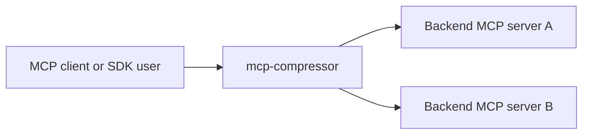

# How it works

`mcp-compressor` sits between an MCP client and one or more backend MCP servers.



The compressor connects to backend servers, reads their tool metadata, and exposes a smaller frontend tool surface.

## Normal compressed tools

Instead of exposing every backend tool directly, the frontend exposes wrappers such as:

- `<server>_get_tool_schema`
- `<server>_invoke_tool`
- `<server>_list_tools` at `max` compression

For a single server named `atlassian`, the client might see:

```text
atlassian_get_tool_schema
atlassian_invoke_tool
atlassian_list_tools
```

A model can first inspect the compact listing, then call `get_tool_schema` only for the tool it wants, then call `invoke_tool`.

## Compression levels

| Level | Tool listing behavior | Typical use |
|---|---|---|
| `low` | More descriptive compressed listings | Smaller servers or exploratory use |
| `medium` | Balanced descriptions and parameter names | Default choice |
| `high` | Very compact listings focused on names/args | Large toolsets |
| `max` | Minimal frontend surface plus `list_tools` | Very large/multi-server setups |

## Transports

Backends can be:

- local stdio MCP server commands,
- remote streamable HTTP MCP URLs.

Frontends can be:

- stdio MCP server mode,
- streamable HTTP MCP server mode,
- local proxy server for generated clients and SDK use.

## Native SDKs

Rust, Python, and TypeScript SDKs can start a compressed proxy in-process without spawning the `mcp-compressor` stdio CLI. The SDKs still start the backend MCP servers or connect to remote backend URLs as configured.
