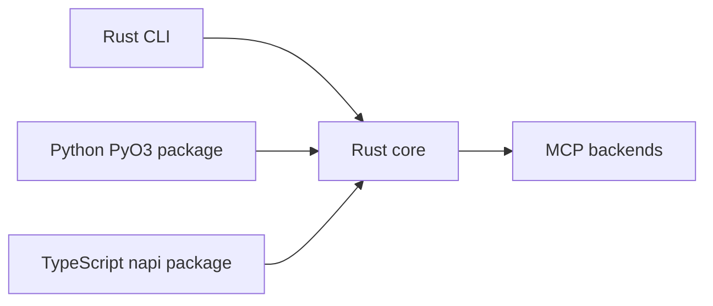

# Rust migration notes

The migration branch moves shared behavior into Rust while keeping Python and TypeScript wrappers idiomatic.

## Current architecture



## Development commands

```bash
make check
cargo check -p mcp-compressor-core
PYTHON="$PWD/.venv/bin/python" cargo test -p mcp-compressor-core --lib -- --nocapture
```

Python package:

```bash
cd python/mcp-compressor
uv run maturin develop
uv run pytest -q tests
```

TypeScript package:

```bash
cd typescript
bun install
bun run build:native
bun run check
```

## Artifact smoke tests

- Rust binary smoke is in CI.
- Python wheel smoke is in CI.
- TypeScript package/native-addon smoke is in CI.
- A `Release Artifacts` workflow builds all three artifact classes together.

## Package publishing

Release package publishing is driven by GitHub Release tags. Workflows derive package versions from tags such as `v1.2.3`; the source tree does not need a version-bump commit for each release.

### Rust crate publishing

The public Rust SDK crate is `mcp-compressor`. It re-exports the implementation crate `mcp-compressor-core`, so both crates are published to crates.io.

Rust crate publishing is handled by the `Publish Rust Crate` workflow. Required secret:

- `CARGO_REGISTRY_TOKEN`

Publishing order matters:

1. patch versions from the tag,
2. publish `mcp-compressor-core`,
3. wait until that version is visible in the crates.io index,
4. package and publish `mcp-compressor`.

### Python package publishing

The `Publish Python Package` workflow builds the PyO3 wheel/source distribution from `python/mcp-compressor` and uploads it to PyPI using trusted publishing (`uv publish --trusted-publishing always`). The public Python import remains `mcp_compressor`; the distribution name is tracked in `python/mcp-compressor/pyproject.toml`.

### TypeScript package publishing

The `Publish TypeScript Package` workflow builds the TypeScript package plus napi native addon, packs it, smoke-tests the packed artifact, and publishes through Atlassian Artifactory `npm-public`, which forwards to public npmjs for allow-listed packages.

The workflow derives the package version from the release tag, for example `v1.2.3`, using `scripts/prepare_typescript_release.py`.

Publishing uses the same artifact-token flow as other Atlassian package workflows:

1. request an npm publish token with `atlassian-labs/artifact-publish-token`,
2. append `@atlassian:registry=https://packages.atlassian.com/api/npm/npm-public/` to the generated npmrc,
3. publish `@atlassian/mcp-compressor` with `npm publish --access public --userconfig ...`.

### Manual validation

Each publish workflow supports manual `workflow_dispatch`. Leave `publish=false` to run validation without uploading artifacts to the package registry.
