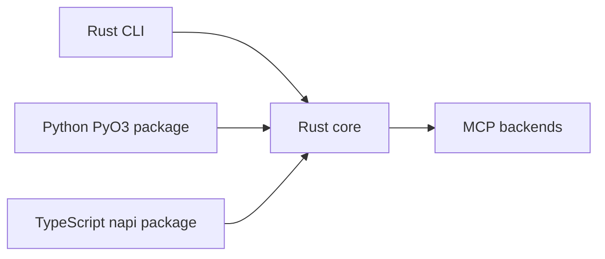

# Rust migration notes

The migration branch moves shared behavior into Rust while keeping Python and TypeScript wrappers idiomatic.

## Current architecture



## Development commands

```bash
make check
cargo check -p mcp-compressor-core
PYTHON="$PWD/.venv/bin/python" cargo test -p mcp-compressor-core --lib -- --nocapture
```

Python package:

```bash
cd python/mcp-compressor-rust
uv run maturin develop
uv run pytest -q tests
```

TypeScript package:

```bash
cd typescript
bun install
bun run build:native
bun run check
```

## Artifact smoke tests

- Rust binary smoke is in CI.
- Python wheel smoke is in CI.
- TypeScript package/native-addon smoke is in CI.
- A manual `Rust Migration Artifacts` workflow builds all three artifact classes together.
