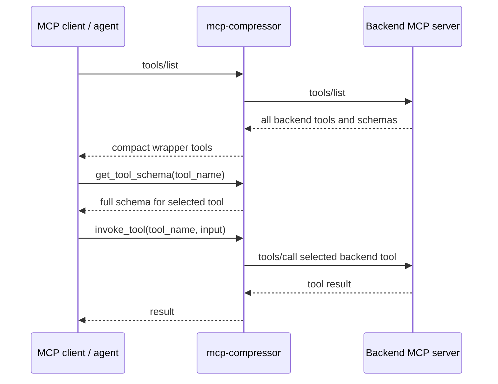
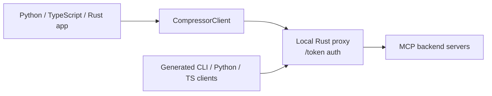

# mcp-compressor

`mcp-compressor` helps agents use large MCP servers without spending huge amounts of context on tool descriptions and schemas.

It can run as a CLI MCP proxy, or be embedded directly from Python, TypeScript, or Rust.

## The problem

A powerful MCP server can expose dozens or hundreds of tools. Each tool has a name, description, input schema, and sometimes large nested JSON Schema details. Sending all of that to a model up front can waste thousands of tokens before the agent has done any useful work.

`mcp-compressor` changes the interaction pattern: the model sees a small compressed surface first, asks for the full schema only for the selected tool, and then invokes that tool.

## Pattern 1: compressed MCP proxy

Use this when you want any MCP client to see a smaller tool surface.



The frontend usually exposes only:

- `get_tool_schema`
- `invoke_tool`
- optionally `list_tools` at `max` compression

## Pattern 2: local proxy for generated clients and SDKs

Use this when your application wants to embed compression directly and call tools from code or shell commands.



The SDK starts the Rust proxy in-process. Generated clients call that proxy using a session token. Your app does **not** need to spawn a `mcp-compressor` stdio subprocess.

## Features

- [Compressed MCP proxy](usage/cli.md#standard-mcp-proxy) for existing MCP clients.
- [Compression levels](concepts/how-it-works.md#compression-levels): `low`, `medium`, `high`, `max`.
- [Python, TypeScript, and Rust SDKs](usage/sdks.md) with aligned `CompressorClient` APIs.
- [CLI Mode and Code Mode generated clients](usage/generated-clients.md): shell commands plus Python/TypeScript functions.
- [Just Bash integration](usage/just-bash.md) for command-oriented agents.
- [Remote streamable HTTP MCP backends](usage/auth-and-remote.md).
- [OAuth support](usage/auth-and-remote.md#native-oauth) for providers that support browser authorization.
- [Tool filters and TOON output](concepts/configuration.md#filters) to further reduce context.
- [Atlassian MCP example](examples/atlassian.md) with OAuth-first usage.
- [CLI reference](reference/cli.md) and [SDK reference overview](reference/sdk.md).

## Quick example

=== "CLI"

    ```bash
    mcp-compressor -c medium -- python server.py
    ```

=== "Python"

    ```python
    from mcp_compressor import CompressorClient

    with CompressorClient(
        servers={"alpha": {"command": "python", "args": ["server.py"]}},
        compression_level="medium",
    ) as proxy:
        print([tool.name for tool in proxy.tools])
        print(proxy.invoke("echo", {"message": "hello"}))
    ```

=== "TypeScript"

    ```ts
    import { CompressorClient } from "@atlassian/mcp-compressor";

    const proxy = await new CompressorClient({
      servers: { alpha: { command: "python", args: ["server.py"] } },
      compressionLevel: "medium",
    }).connect();

    try {
      console.log(proxy.tools.map((tool) => tool.name));
      console.log(await proxy.invoke("echo", { message: "hello" }));
    } finally {
      proxy.close();
    }
    ```

=== "Rust"

    ```rust
    use mcp_compressor::compression::CompressionLevel;
    use mcp_compressor::sdk::{CompressorClient, ServerConfig};
    use serde_json::json;

    let proxy = CompressorClient::builder()
        .server("alpha", ServerConfig::command("python").arg("server.py"))
        .compression_level(CompressionLevel::Medium)
        .build()
        .connect()
        .await?;

    let result = proxy.invoke("echo", json!({ "message": "hello" })).await?;
    ```

## Where to go next

1. [Install the package you need](getting-started/installation.md).
2. Run the [quickstart](getting-started/quickstart.md).
3. Read [how compression works](concepts/how-it-works.md).
4. Choose between [CLI usage](usage/cli.md), [SDK usage](usage/sdks.md), [generated clients](usage/generated-clients.md), and [Just Bash](usage/just-bash.md).
