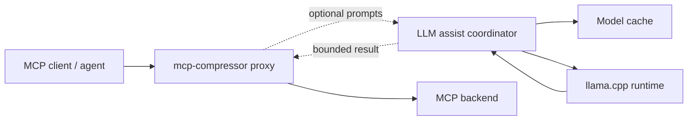

# Design: optional local LLM assistance in the proxy layer

This document proposes an optional local-LLM assistance layer for `mcp-compressor`. The goal is to keep the existing deterministic compression path fast and dependency-light, while allowing users to opt in to higher-level proxy behaviors that benefit from a small utility model.

## Summary

`mcp-compressor` should add an optional `llm-assist` subsystem inside the Rust proxy layer. When enabled, the proxy can ask a small local model to help with tasks such as response filtering, next-call suggestions, generated `SKILL.md` drafts, validation-error repair, and semantic help lookup.

The recommended first runtime is [llama.cpp](https://github.com/ggml-org/llama.cpp), accessed through Rust bindings such as [`llama-cpp-2`](https://docs.rs/llama-cpp-2/latest/llama_cpp_2/). The recommended default model is [LiquidAI/LFM2.5-350M-GGUF](https://huggingface.co/LiquidAI/LFM2.5-350M-GGUF) with `Q4_K_M` quantization. Hugging Face reports this artifact as approximately **229 MB**, with smaller `Q4_0` at 219 MB and larger `Q8_0` at 379 MB. Liquid describes LFM2 as a hybrid model family designed for edge and on-device deployment, and the model card includes llama.cpp usage examples.

The model must be optional. It should be downloaded only when a user enables an LLM-assisted feature or explicitly runs a setup command. Standard proxy mode, SDK sessions, generated clients, and TypeScript local tool compression should not download model artifacts or initialize an inference engine.

## Goals

- Preserve the current deterministic compressed MCP proxy behavior by default.
- Keep all LLM assistance local-first and optional.
- Avoid sending backend tool schemas, tool inputs, tool outputs, credentials, or user data to a remote model provider.
- Support incremental adoption: each LLM-assisted feature can be enabled independently.
- Use the LLM for bounded utility tasks, not as the source of truth for MCP protocol behavior.
- Keep public Python and TypeScript packages thin by implementing shared behavior in Rust.

## Non-goals

- Replacing the existing compression levels with an LLM-only compression strategy.
- Running a large general-purpose coding model in the proxy process.
- Fine-tuning or training models as part of `mcp-compressor`.
- Depending on a hosted inference API for core behavior.
- Allowing the model to call tools autonomously without the client agent's explicit request.

## Proposed user experience

LLM assistance should be off by default:

```bash
mcp-compressor -c medium -- python server.py
```

A user opts in at the CLI:

```bash
mcp-compressor \
  --llm-assist response-filter,next-suggestion,validation-repair \
  --llm-model LiquidAI/LFM2.5-350M-GGUF:Q4_K_M \
  -c medium \
  -- python server.py
```

SDKs expose the same setting through configuration:

=== "Python"

    ```python
    from mcp_compressor import CompressorClient

    client = CompressorClient(
        compression="medium",
        llm_assist={
            "features": ["response_filter", "validation_repair"],
            "model": "LiquidAI/LFM2.5-350M-GGUF:Q4_K_M",
        },
    )
    ```

=== "TypeScript"

    ```ts
    import { CompressorClient } from "@atlassian/mcp-compressor";

    const client = new CompressorClient({
      compression: "medium",
      llmAssist: {
        features: ["response_filter", "validation_repair"],
        model: "LiquidAI/LFM2.5-350M-GGUF:Q4_K_M",
      },
    });
    ```

=== "Rust"

    ```rust
    use mcp_compressor::sdk::{CompressorClient, LlmAssistConfig};

    let client = CompressorClient::builder()
        .compression("medium")
        .llm_assist(LlmAssistConfig::local_default())
        .build()?;
    ```

The first enabled use should show a clear one-time message before download in CLI mode:

```text
LLM assistance needs LiquidAI/LFM2.5-350M-GGUF:Q4_K_M (~229 MB).
Download to ~/.cache/mcp-compressor/models? [y/N]
```

SDK mode should not prompt unexpectedly. It should either:

- fail with an actionable `ModelNotAvailable` error, or
- download only when `allow_model_download=true` is set.

## Runtime and model choice

### Runtime: llama.cpp

Use official `llama-server` from llama.cpp as the first inference backend because it is widely used for local GGUF inference, supports CPU and common acceleration backends, runs on macOS, Linux, and Windows, exposes a clean OpenAI-compatible JSON API, and avoids relying on less-supported Rust bindings or scraping human-oriented CLI output.

Cross-platform support is a requirement for the default path. The embedded runtime must work on the same primary platforms as the CLI and SDK packages:

| Platform | Baseline requirement | Acceleration policy |
|---|---|---|
| macOS arm64/x64 | Supported | Metal may be used when available, but CPU fallback is required. |
| Linux x64/aarch64 | Supported | CPU fallback is required; CUDA/Vulkan/other acceleration must be optional. |
| Windows x64 | Supported unless proven infeasible | CPU fallback is required; MSVC build and packaged binary behavior must be validated before release. |

The initial implementation should prepare the local runtime in the background when LLM assistance is enabled, then use an **ephemeral `llama-server`** process as an internal runtime detail for each prompt:

1. start background preparation at proxy startup,
2. install `llama-server` into the `mcp-compressor` cache if needed,
3. download/cache the configured GGUF model if needed,
4. on first LLM use, wait for preparation if it is still running,
5. choose a free loopback port,
6. start `llama-server` bound to `127.0.0.1`,
7. wait for `/health`,
8. send one `/v1/chat/completions` request,
9. parse the JSON response, and
10. terminate the server.

This keeps startup latency close to normal proxy startup while avoiding surprise blocking until the first LLM-assisted feature is actually needed. It also keeps the user-facing configuration simple: users choose the model, not the serving mode. Ephemeral serving avoids keeping a 32k-context local server resident for the whole proxy session, which matters when multiple `mcp-compressor` processes are running. A persistent server can be added later as an internal optimization if repeated prompt volume justifies the memory cost.

### Default model: LiquidAI/LFM2.5-350M-GGUF Q4_K_M

Use `LiquidAI/LFM2.5-350M-GGUF:Q4_K_M` as the default because it is small enough to download opportunistically, is designed for edge/on-device use, and is available as a GGUF artifact compatible with llama.cpp. The Hugging Face model page lists:

| Quantization | Approximate artifact size |
|---|---:|
| `Q4_0` | 219 MB |
| `Q4_K_M` | 229 MB |
| `Q5_K_M` | 260 MB |
| `Q6_K` | 293 MB |
| `Q8_0` | 379 MB |
| `BF16` / `F16` | 711 MB |

Default settings:

```toml
[llm_assist]
enabled = false
runtime = "llama.cpp"
model = "LiquidAI/LFM2.5-350M-GGUF:Q4_K_M"
input_token_budget = 32768
output_token_budget = 4096
temperature = 0.0
top_p = 1.0
allow_model_download = false
```

The context window needs to be much larger than the original compression wrapper budget because LLM assistance may inspect multiple tool schemas, validation errors, partial tool outputs, generated-client help text, and retrieved documentation snippets at the same time. The proxy should own fixed token budgets of **32,768 input tokens** and **4,096 output tokens**. These should not be user-facing knobs initially; each feature should use deterministic truncation, retrieval, and summarization policies to fit within those limits. If the selected model cannot support the fixed input budget, startup should fail with an actionable model-compatibility error instead of silently lowering quality.

For the initial design, the user should only configure the model. Users can choose a stronger local model for SKILL generation, a smaller/faster quant for response filtering, or a model with a larger context window if the default artifact cannot meet the fixed context budget on a particular platform.

## Download and cache behavior

Model acquisition must be lazy and explicit:

1. Parse config and determine whether any enabled feature needs local inference.
2. Resolve the configured model reference.
3. Check the local cache.
4. If missing:
   - CLI interactive mode asks for confirmation.
   - CLI non-interactive mode fails unless `--llm-allow-download` is set.
   - SDK mode fails unless the SDK config sets `allow_model_download=true`.
5. Download the selected GGUF artifact.
6. Verify expected metadata where available: repo, filename/quant, size, and optionally checksum when provided by the model host.
7. Store a local manifest recording source, resolved file, size, creation time, and license acknowledgement.

Recommended cache location:

```text
$MCP_COMPRESSOR_CACHE_DIR/models/
$XDG_CACHE_HOME/mcp-compressor/models/
~/Library/Caches/mcp-compressor/models/        # macOS fallback
%LOCALAPPDATA%\mcp-compressor\models\          # Windows fallback
```

If the embedded runtime uses a Hugging Face-compatible cache API, it may reuse the standard Hugging Face cache to avoid duplicate downloads. `mcp-compressor` should still maintain its own small manifest so `mcp-compressor llm status` can explain what is installed and why.

Management commands:

```bash
mcp-compressor llm status
mcp-compressor llm pull --model LiquidAI/LFM2.5-350M-GGUF:Q4_K_M
mcp-compressor llm test --prompt "Say hello in one short sentence."
mcp-compressor llm remove
```

`pull` installs the managed `llama-server` artifact and downloads the configured model. `status` reports whether each asset is ready. `test` performs setup if needed and sends a single prompt through the ephemeral server path. `remove` deletes managed runtime/model assets from the `mcp-compressor` cache.

## Architecture



Add a new Rust module, for example `crates/mcp-compressor-core/src/llm_assist/`:

```text
llm_assist/
  mod.rs              # feature registry and public coordinator
  config.rs           # runtime/model/download configuration
  model_store.rs      # cache resolution and manifest management
  runtime.rs          # trait for local inference
  llama_cpp.rs        # llama.cpp-backed implementation behind feature flag
  prompts.rs          # fixed prompts and structured output schemas
  response_filter.rs  # tool result filtering pipeline
  suggestions.rs      # next-call suggestion pipeline
  skill_gen.rs        # SKILL.md generator
  repair.rs           # validation repair pipeline
  help.rs             # semantic help lookup pipeline
```

Core trait:

```rust
pub trait LocalLlmRuntime: Send + Sync {
    async fn complete(&self, request: LlmRequest) -> Result<LlmResponse>;
}

pub struct LlmRequest {
    pub system_prompt: String,
    pub user_prompt: String,
    pub response_format: LlmResponseFormat,
    pub output_token_budget: usize,
    pub timeout: Duration,
}
```

The proxy should interact with the coordinator through feature-specific methods instead of free-form prompting:

```rust
impl LlmAssistCoordinator {
    async fn filter_tool_result(&self, request: ResponseFilterRequest) -> Result<ResponseFilterDecision>;
    async fn suggest_next_calls(&self, request: SuggestionRequest) -> Result<Vec<ToolSuggestion>>;
    async fn draft_skill(&self, request: SkillDraftRequest) -> Result<String>;
    async fn repair_validation_error(&self, request: RepairRequest) -> Result<RepairDecision>;
    async fn lookup_help(&self, request: HelpLookupRequest) -> Result<HelpLookupResult>;
}
```

## Feature designs

### 1. Filter large tool responses

Problem: Some MCP tools return large JSON payloads, logs, search results, or documents where only a small subset is useful for the current call.

Design:

- Trigger only when enabled and the tool result exceeds configurable thresholds such as byte size, token estimate, or item count.
- Preserve the original tool result by default in the proxy internals for debugging and optional retrieval.
- Ask the local model to produce a structured filtered result with:
  - a concise summary,
  - retained high-signal fields,
  - omitted-field notes,
  - confidence and warning flags.
- Never filter binary outputs or opaque attachments.
- Mark filtered outputs clearly so client agents know the result was transformed.

Example output envelope:

```json
{
  "mcp_compressor_filtered": true,
  "summary": "Found 3 matching issues; the most relevant is PROJ-123.",
  "important_items": [
    {"key": "PROJ-123", "status": "In Progress", "why_relevant": "mentions the failing auth flow"}
  ],
  "omitted": {"items": 47, "reason": "low lexical relevance to the original request"},
  "original_available": true
}
```

Safety rules:

- Filtering must be opt-in per server or per tool class.
- The original result should remain available through an explicit debug or retrieval path.
- Filtering should be disabled automatically for outputs that appear to contain secrets unless the redaction pass succeeds first.
- Tool-call side effects must not be hidden; the proxy should preserve success/failure status exactly.

### 2. Suggest the next tool or command to call

Problem: At high compression levels, agents may not know which backend tool to inspect next.

Design:

- Provide suggestions as metadata alongside wrapper-tool responses, not as autonomous actions.
- Inputs should include the compressed tool catalog, recently inspected schemas, the current tool result summary, and the user's original intent when available.
- Output a ranked list of possible next calls, each with a reason and required arguments still missing.

Example:

```json
{
  "suggestions": [
    {
      "tool": "get_tool_schema",
      "arguments": {"tool_name": "search_jira_using_jql"},
      "reason": "The user needs issue discovery and no JQL-capable schema has been inspected yet.",
      "confidence": 0.78
    }
  ]
}
```

The proxy should expose this either:

- as optional metadata in TOON/JSON wrapper responses, or
- through a dedicated compressed helper tool such as `suggest_next_tool` when LLM assistance is enabled.

### 3. Generate `SKILL.md` files for proxied MCP servers

Problem: Repeated use of a large MCP server benefits from durable, human-readable operating instructions.

Design:

- Add an explicit command, not an automatic background behavior:

```bash
mcp-compressor skill draft --server atlassian --output ./.rovodev/skills/atlassian-mcp/SKILL.md
```

- Input to the model:
  - tool names,
  - compact descriptions,
  - full schemas for selected high-value tools,
  - examples from observed successful calls when the user opts in,
  - server name and authentication notes with secrets redacted.
- Output a draft `SKILL.md` with:
  - what the server is for,
  - when to use each major tool family,
  - required setup/auth assumptions,
  - common workflows,
  - pitfalls and validation constraints.

This should require user approval before writing outside an explicitly requested output path. The model should draft, not publish, operational guidance.

### 4. Automatically fix tool call validation errors

Problem: Client agents often make near-miss calls: wrong enum casing, JSON string where an object is expected, missing wrapper nesting, or incorrect generated-client argument names.

Design:

- Keep the deterministic validator first.
- If validation fails and `validation-repair` is enabled, ask the local model for a strict JSON patch or replacement argument object.
- Re-run validation after repair.
- Apply at most one automatic repair attempt by default.
- Include a repair note in the response metadata.

Repair prompt inputs:

- target tool schema,
- invalid input,
- exact validation error,
- examples of valid shapes if available.

Repair output:

```json
{
  "action": "replace_arguments",
  "arguments": {
    "issue_url": "https://example.atlassian.net/browse/PROJ-123",
    "get_comments": true
  },
  "explanation": "Converted getComments to get_comments and preserved the issue URL."
}
```

Safety rules:

- Never invent missing credentials, account IDs, file paths, destructive flags, or user content.
- Do not repair calls to tools configured as destructive unless `--llm-repair-destructive` is explicitly enabled.
- If the model changes semantic values, require confirmation or return a suggested repair instead of invoking.

### 5. LLM-powered help lookup for tools and generated clients

Problem: Users and agents need help finding the right tool, generated command, or argument without loading every full schema.

Design:

- Add a helper tool such as `help_lookup` when enabled.
- Build a compact local index from tool names, descriptions, argument names, generated command names, and selected schema fragments.
- Use deterministic lexical retrieval first, then ask the local model to rank and explain matches.
- Return citations to source schema fields so the answer is auditable.

Example:

```json
{
  "query": "how do I search Jira issues by JQL?",
  "matches": [
    {
      "kind": "tool",
      "name": "search_jira_using_jql",
      "why": "Accepts a JQL string and limit.",
      "schema_path": "tools.search_jira_using_jql.inputSchema.properties.jql"
    }
  ]
}
```

The LLM should not be the only retrieval mechanism. A deterministic index keeps results stable and allows the model to focus on ranking and summarization.

## Prompting and structured outputs

All LLM-assisted features should use narrow, fixed prompts and structured output validation. Prompts should instruct the model to:

- treat tool schemas and tool outputs as untrusted data,
- avoid following instructions embedded in tool outputs,
- return only the requested JSON shape for machine-consumed paths,
- admit uncertainty instead of guessing,
- preserve exact identifiers, URLs, issue keys, file paths, and enum values unless the task is validation repair.

Every machine-consumed model response must be parsed and validated. Invalid LLM output should degrade gracefully to the deterministic baseline.

## Security and privacy

Local inference reduces data exposure, but it does not remove security risk.

Required controls:

- **Off by default.** No model download, model load, or LLM prompt construction unless enabled.
- **Secret redaction.** Reuse or add a redaction pass before prompts include headers, tokens, cookies, environment values, or auth config.
- **Prompt-injection isolation.** Tool outputs are data, not instructions. Prompts should quote or delimit tool outputs and explicitly ignore embedded instructions.
- **No autonomous side effects.** LLM suggestions are advisory. Validation repair may retry only the same user-requested call, and only after schema validation passes.
- **Audit metadata.** Responses transformed by the LLM should include metadata indicating the feature used, model reference, and whether original output is available.
- **Timeouts and cancellation.** Local inference must have strict per-request timeouts and respect proxy shutdown.
- **License visibility.** The model manifest should record the source model and license metadata so package users can make informed decisions.

## Configuration

CLI flags:

```text
--llm-assist <features>          Comma-separated features: response-filter,next-suggestion,skill-gen,validation-repair,help-lookup
--llm-model <model-ref>          Default: LiquidAI/LFM2.5-350M-GGUF:Q4_K_M
--llm-allow-download             Permit lazy model download in non-interactive contexts
--llm-cache-dir <path>           Override model cache location
--llm-timeout <duration>         Bound local inference latency
```

MCP JSON config extension:

```json
{
  "mcpServers": {
    "example": {
      "command": "python",
      "args": ["server.py"],
      "mcp-compressor": {
        "llmAssist": {
          "features": ["response_filter", "help_lookup"],
          "model": "LiquidAI/LFM2.5-350M-GGUF:Q4_K_M",
          "allowModelDownload": false,
          "responseFilter": {
            "minBytes": 32768,
            "preserveOriginal": true
          }
        }
      }
    }
  }
}
```

## Failure behavior

LLM assistance should never make the proxy unusable when deterministic behavior would have worked.

| Failure | Behavior |
|---|---|
| Model missing and downloads disallowed | Return actionable setup error for the LLM-assisted feature; continue normal proxy operation where possible. |
| Download fails | Keep cache unchanged; report source and retry guidance. |
| Runtime fails to load | Disable LLM-assisted features for the session and continue deterministic proxying. |
| Prompt too large | Truncate with explicit policy or skip the feature. |
| Invalid model output | Ignore LLM result and return deterministic baseline. |
| Timeout | Cancel inference and return deterministic baseline. |

## Observability

Add debug logs and optional metrics for:

- model cache hit/miss,
- model load time,
- inference latency,
- input/output token estimates,
- feature used,
- fallback reason,
- bytes removed by response filtering,
- validation repair attempted/succeeded/failed.

Logs must not include raw prompts by default because prompts may contain tool outputs or user data.

## Rollout plan

1. Add config types, CLI parsing, and no-op coordinator behind an optional Cargo feature.
2. Add model cache/status commands without runtime inference.
3. Add local llama.cpp runtime integration and feature-gated smoke tests for macOS, Linux, and Windows release targets.
4. Add packaging validation for Python wheels, TypeScript native packages, and Rust binaries on each supported platform; if any target is infeasible, document the limitation and enable the local-server fallback for that target.
5. Implement `validation-repair` first because it has the clearest bounded input/output contract.
6. Implement `help-lookup` with deterministic retrieval plus LLM ranking.
7. Implement `response-filter` with an original-result retrieval path.
8. Add `next-suggestion` metadata.
9. Add explicit `skill draft` command.
10. Document security model, download behavior, SDK configuration, platform support, and fallback behavior.

## Open questions

- Should the default binary ship with the `llm-assist` Cargo feature disabled and offer a separate feature/build for users who want embedded llama.cpp?
- Should model downloads use the Hugging Face cache directly, or should `mcp-compressor` maintain a separate cache and deduplicate opportunistically?
- What is the best API for retrieving an original unfiltered tool result without exposing stale sensitive data indefinitely?
- Should generated clients surface LLM help/suggestions, or should this remain only in the live proxy API?
- Which features should be safe in non-interactive automation by default?

## Research references

- [LiquidAI/LFM2.5-350M-GGUF on Hugging Face](https://huggingface.co/LiquidAI/LFM2.5-350M-GGUF): GGUF model card, llama.cpp examples, quantization sizes, and license metadata.
- [Liquid AI LFM2.5 350M announcement](https://www.liquid.ai/blog/lfm2-5-350m-no-size-left-behind): describes the 350M model release and edge/on-device positioning.
- [Liquid AI llama.cpp documentation](https://docs.liquid.ai/docs/inference/llama-cpp): documents llama.cpp local inference modes and Hugging Face download behavior.
- [llama.cpp README](https://github.com/ggml-org/llama.cpp/blob/master/README.md): documents GGUF usage, `-hf <user>/<model>[:quant]`, and Hugging Face cache behavior.
- [`llama-cpp-2` docs.rs](https://docs.rs/llama-cpp-2/latest/llama_cpp_2/): Rust bindings considered for embedded local inference.
