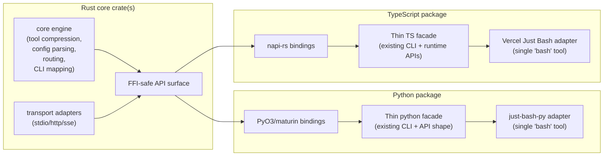

# Unified Rust Core Library Design (Draft)

## Problem

`mcp-compressor` now has both Python and TypeScript implementations. If core behavior continues to evolve independently, feature drift and maintenance cost will increase.

## Goals

Move core behavior into a shared Rust library, while keeping thin, idiomatic wrappers for Python and TypeScript.

For both language packages, preserve support for:

- all existing tool compression behavior
- JSON MCP configuration (single and multi-server)
- CLI mode for single and multi-server setups
- stdio MCP proxy-server operation
- direct in-process client/library usage (no stdio subprocess requirement)

Also add:

- TypeScript integration with Vercel Just Bash, exposing one `bash` tool that combines:
  - full Just Bash functionality
  - in-memory CLI access to one or more proxied MCP servers
- Python integration with `just-bash-py` (the Python package for Just Bash) with equivalent behavior

## Non-Goals (Initial Phase)

- rewriting FastMCP, MCP SDKs, or OAuth protocol internals in Rust
- replacing language-specific UX layers where idiomatic wrappers are preferred
- introducing behavior changes to compression semantics by default

## Proposed Architecture



## Rust Core Responsibilities

1. **Compression engine**
   - canonical tool listing compression for `low|medium|high|max`
   - schema lookup and invocation routing
   - include/exclude filtering
   - validation error enrichment
2. **Config + topology**
   - parse MCP config JSON for one or many servers
   - normalize server naming/prefix rules
3. **Proxy runtime primitives**
   - server registry and request routing
   - shared data models for tool/resource/prompt passthrough
4. **CLI-mode primitives**
   - command schema mapping
   - subcommand/flag translation
   - per-server in-memory CLI execution entrypoints
5. **Stable FFI layer**
   - versioned ABI/API boundary consumed by Python/TS wrappers

## Language Wrapper Responsibilities

### Python wrapper

- preserve current CLI UX and flags
- expose Python-native in-process client API backed by Rust runtime
- bridge to `just-bash-py`:
  - export one `bash` tool
  - include standard just-bash commands
  - add proxied MCP-server CLI commands as in-memory subcommands

### TypeScript wrapper

- preserve current TS CLI and runtime API ergonomics
- expose Node-native in-process client API backed by Rust runtime
- bridge to Vercel Just Bash:
  - export one `bash` tool
  - include standard Just Bash capabilities
  - add proxied MCP-server CLI commands as in-memory subcommands

## Just Bash Integration Model (Both Languages)

The language layer registers backend MCP servers as custom command providers. Each provider delegates execution to Rust:

1. parse user command and arguments
2. resolve target server/tool using Rust routing tables
3. invoke backend through Rust proxy runtime
4. return rendered output through Just Bash response conventions

This keeps command parsing and server-routing consistent across Python and TypeScript.

## Phased Delivery Plan

### Phase 0 — Contract and parity tests

- define canonical behavioral contract (compression outputs, schema retrieval, invocation, config parsing)
- add cross-language parity fixtures consumed by Python and TS tests

### Phase 1 — Rust core extraction

- implement compression/config/routing modules in Rust
- expose C-ABI-safe surface and high-level binding-friendly APIs

### Phase 2 — TypeScript migration

- replace TS core logic with Rust-backed bindings
- keep existing public API/CLI behavior stable
- add Just Bash single-tool integration

### Phase 3 — Python migration

- replace Python core logic with Rust-backed bindings
- keep existing public API/CLI behavior stable
- add `just-bash-py` single-tool integration

### Phase 4 — Hardening + rollout

- benchmark latency/token outputs versus current implementations
- complete docs/migration notes
- release behind optional feature flag first, then make default

## Risks and Mitigations

- **Binding complexity across two ecosystems**
  Use mature tooling: `PyO3` + `maturin` (Python) and `napi-rs` (TypeScript).
- **Behavior regressions during migration**
  Maintain parity fixtures and run language-level golden tests against shared scenarios.
- **Operational complexity from native artifacts**
  Publish prebuilt wheels and Node binaries for major targets; keep a pure-language fallback path temporarily during migration.

## Open Questions

- Should OAuth token persistence remain language-side initially, or move to Rust once parity is proven?
- Do we need a strict semver contract for the Rust FFI layer, or can wrappers pin exact core versions early on?
- Should Just Bash integrations be optional package extras/features in the first release?

---

## Extended Design: Generic Tool Proxy and Multi-Target Client Generation

### Motivation

The current CLI mode hardwires the local HTTP bridge to a single output format: a shell script (Unix or Windows `.cmd`).
The proxy itself and the generated client are tightly coupled, which prevents reuse.

By separating the **generic tool proxy** from the **client generator**, we can use the same proxy for any generated client artifact:

- shell CLI scripts (current behaviour)
- Python library modules
- TypeScript / Node.js modules

All three patterns follow the same runtime contract:

1. Start the local tool proxy with a freshly generated bearer token.
2. Generate the client artifact with the token hardcoded.
3. The client artifact calls `POST /exec` with `Authorization: Bearer <token>`.
4. The proxy validates the token and dispatches the tool call.

This mirrors how Jupyter Notebook generates a one-time token at startup and embeds it in the server URL — the token is an opaque secret that scopes each server session.

---

### Generic Tool Proxy

The local tool proxy is a minimal HTTP server that:

- listens on `127.0.0.1:<port>` (random free port by default)
- generates a cryptographically random session token at startup (e.g. `secrets.token_hex(32)`)
- requires `Authorization: Bearer <token>` on every request (except `GET /health`)
- exposes two endpoints:

| Method | Path      | Description                                      |
|--------|-----------|--------------------------------------------------|
| GET    | /health   | liveness check (no auth required)                |
| POST   | /exec     | accept `{"tool": "<name>", "input": {...}}` body |

The token is printed to stderr at startup (informational only) and is embedded at generation time into every client artifact that is produced for that session.

Token validation must be constant-time to avoid timing side-channels.

#### Why a bearer token?

- The proxy only binds to loopback, so network exposure is already limited.
- A bearer token prevents any other local process (or stale script from a previous session) from calling the proxy unintentionally.
- It matches the familiar Jupyter pattern, which is well understood by practitioners.
- Stale scripts from previous sessions simply fail to authenticate; they do not silently call the wrong backend.

---

### Client Generator Architecture

The `ClientGenerator` trait / abstract class produces one or more artifact files from the same inputs:

```
ClientGenerator.generate(
    cli_name: str,
    bridge_url: str,      # e.g. "http://127.0.0.1:51234"
    token: str,           # session bearer token, hardcoded into artifact
    tools: list[Tool],
    session_pid: int,
    output_dir: Path,
) -> list[Path]           # paths of generated artifact files
```

Three built-in generators ship with the initial implementation:

| Generator        | Artifact(s)                                          | Notes                                    |
|------------------|------------------------------------------------------|------------------------------------------|
| `CliGenerator`   | `<cli_name>` (Unix) / `<cli_name>.cmd` (Windows)    | current behaviour, adapted to use token  |
| `PythonGenerator`| `<cli_name>.py`                                      | importable module + `__main__` entry     |
| `TypeScriptGenerator` | `<cli_name>.ts` + `<cli_name>.d.ts`           | ESM module, one function per tool        |

All generators receive the same token and embed it as a constant in the generated artifact.

---

### Bearer Token in the Proxy Server

**Rust side (`proxy/auth.rs`):**

```
pub struct SessionToken(String);

impl SessionToken {
    pub fn generate() -> Self { /* rand::random::<[u8; 32]>().hex() */ }
    pub fn verify(&self, header: &str) -> bool { /* constant-time compare */ }
}
```

**Python side (`proxy/auth.py`):**

```python
import secrets, hmac

class SessionToken:
    def __init__(self) -> None:
        self._token = secrets.token_hex(32)

    @property
    def value(self) -> str:
        return self._token

    def verify(self, header: str | None) -> bool:
        if header is None:
            return False
        expected = f"Bearer {self._token}"
        return hmac.compare_digest(expected, header)
```

The proxy server middleware checks the token before routing any `POST /exec` request and returns `HTTP 401` on mismatch.

---

### Generated Client Artifacts

#### CLI script (adapted from current behaviour)

The generated shell script gains a `TOKEN` constant and includes it in every request:

```python
TOKEN = "a3f7...deadbeef"   # hardcoded at generation time

req = urllib.request.Request(
    bridge + "/exec",
    data=payload,
    headers={
        "Content-Type": "application/json",
        "Authorization": f"Bearer {TOKEN}",
    },
    method="POST",
)
```

#### Python library module

`<cli_name>.py` is a self-contained importable module. Each upstream tool becomes a typed Python function:

```python
# generated by mcp-compressor — do not edit manually
import httpx

_BRIDGE = "http://127.0.0.1:51234"
_TOKEN  = "a3f7...deadbeef"
_HEADERS = {"Authorization": f"Bearer {_TOKEN}"}

def get_confluence_page(page_id: str, *, space_key: str | None = None) -> str:
    """Retrieve a Confluence page by ID."""
    resp = httpx.post(
        f"{_BRIDGE}/exec",
        json={"tool": "get_confluence_page", "input": {"page_id": page_id, "space_key": space_key}},
        headers=_HEADERS,
    )
    resp.raise_for_status()
    return resp.text
```

This allows any Python code (or an LLM-driven agent) to `import <cli_name>` and call backend MCP tools as ordinary functions, without running an MCP client.

#### TypeScript / Node.js module

`<cli_name>.ts` is a typed ESM module. Each tool becomes an exported async function:

```typescript
// generated by mcp-compressor — do not edit manually
const BRIDGE = "http://127.0.0.1:51234";
const TOKEN  = "a3f7...deadbeef";
const HEADERS = { Authorization: `Bearer ${TOKEN}`, "Content-Type": "application/json" };

export async function getConfluencePage(pageId: string, spaceKey?: string): Promise<string> {
  const res = await fetch(`${BRIDGE}/exec`, {
    method: "POST",
    headers: HEADERS,
    body: JSON.stringify({ tool: "get_confluence_page", input: { page_id: pageId, space_key: spaceKey } }),
  });
  if (!res.ok) throw new Error(await res.text());
  return res.text();
}
```

An accompanying `<cli_name>.d.ts` declaration file is generated for projects that consume the module without bundling.

---

### Multi-session Support

The same multi-session BRIDGES map used in the current CLI scripts is extended to all generators:

```
BRIDGES = {
    <session_pid>: {"url": "http://127.0.0.1:<port>", "token": "<token>"},
    ...
}
```

Because each bridge entry now carries its own token, generated artifacts from different sessions cannot interfere with one another even if a stale artifact is left on disk.

---

### Code Organization Map

#### Rust crate (`crates/mcp-compressor-core/`)

```
crates/mcp-compressor-core/
└── src/
    ├── lib.rs                   # public re-exports; crate feature flags
    ├── compression/
    │   ├── mod.rs
    │   ├── engine.rs            # tool listing compression for low|medium|high|max
    │   └── levels.rs            # CompressionLevel enum and per-level formatters
    ├── config/
    │   ├── mod.rs
    │   └── topology.rs          # MCPConfig parse, server naming, prefix rules
    ├── proxy/
    │   ├── mod.rs
    │   ├── server.rs            # generic tool proxy HTTP server
    │   ├── auth.rs              # SessionToken: generate, verify (constant-time)
    │   ├── router.rs            # request routing: /health, /exec
    │   └── registry.rs          # server registry and multi-server routing
    ├── client_gen/
    │   ├── mod.rs
    │   ├── generator.rs         # ClientGenerator trait (generate → Vec<PathBuf>)
    │   ├── cli.rs               # CliGenerator  → shell script (.sh / .cmd)
    │   ├── python.rs            # PythonGenerator → <name>.py module
    │   └── typescript.rs        # TypeScriptGenerator → <name>.ts + .d.ts
    ├── cli/
    │   ├── mod.rs
    │   ├── mapping.rs           # tool_name_to_subcommand, sanitize_cli_name
    │   └── parser.rs            # argv → tool_input (JSON Schema-driven)
    └── ffi/
        ├── mod.rs
        └── types.rs             # FFI-safe structs and C-ABI surface
```

#### Python package (`mcp_compressor/`)

```
mcp_compressor/
├── main.py                      # CLI entry point (unchanged public API)
├── tools.py                     # CompressedTools middleware (unchanged)
├── types.py                     # CompressionLevel, LogLevel, TransportType
├── cli_tools.py                 # tool_name_to_subcommand, parse_argv, help text
├── logging.py                   # configure_logging, OAuth traceback suppression
├── oauth.py                     # OAuth token persistence helpers
├── banner.py                    # startup banner
├── proxy/
│   ├── __init__.py
│   ├── server.py                # ToolProxyServer (replaces CliBridge)
│   │                            #   - binds 127.0.0.1:<port>
│   │                            #   - generates SessionToken at startup
│   │                            #   - validates Bearer token on /exec
│   │                            #   - routes /health and /exec
│   └── auth.py                  # SessionToken (generate, constant-time verify)
└── client_gen/
    ├── __init__.py
    ├── base.py                  # ClientGenerator ABC: generate() → list[Path]
    ├── cli.py                   # CliGenerator (replaces cli_script.py)
    │                            #   - Unix shebang script + Windows .cmd
    │                            #   - BRIDGES map with {pid: {url, token}}
    ├── python_lib.py            # PythonGenerator
    │                            #   - one function per tool, typed signatures
    │                            #   - httpx-based, token in module constant
    └── typescript_lib.py        # TypeScriptGenerator
                                 #   - ESM async functions, typed with TS interfaces
                                 #   - fetch-based, .ts + .d.ts output
```

`CliBridge` and `cli_script.py` are superseded by `proxy/server.py` and `client_gen/cli.py` respectively.
The public CLI flags (`--cli-mode`, `--cli-port`) and all existing behaviour are preserved.

#### TypeScript package (`typescript/`)

```
typescript/
├── src/
│   ├── index.ts                 # public exports
│   ├── proxy/
│   │   ├── server.ts            # ToolProxyServer (HTTP, token auth)
│   │   └── auth.ts              # SessionToken
│   └── client_gen/
│       ├── base.ts              # ClientGenerator interface
│       ├── cli.ts               # CliGenerator (shell script)
│       ├── pythonLib.ts         # PythonGenerator
│       └── typescriptLib.ts     # TypeScriptGenerator
└── README.md
```

---

### Updated Phased Delivery Plan

#### Phase 0 — Contract and parity tests *(unchanged)*

- define canonical behavioral contract
- add cross-language parity fixtures

#### Phase 1 — Rust core extraction *(unchanged)*

- compression/config/routing modules in Rust
- stable C-ABI surface

#### Phase 2 — Generic proxy + token auth (new)

- implement `SessionToken` in Rust (`proxy/auth.rs`) and Python (`proxy/auth.py`)
- refactor `CliBridge` → `ToolProxyServer` with token validation middleware
- update CLI generator to embed token in BRIDGES entries
- add `POST /exec` token check returning `HTTP 401` on mismatch

#### Phase 3 — Python library generator (new)

- implement `PythonGenerator` in `client_gen/python_lib.py`
- expose via `--generate-python-lib <output_dir>` CLI flag
- add `httpx` as an optional dependency (`pip install mcp-compressor[python-lib]`)

#### Phase 4 — TypeScript module generator (new)

- implement `TypeScriptGenerator` in `client_gen/typescript_lib.ts`
- expose via `--generate-ts-lib <output_dir>` CLI flag
- emit `.ts` + `.d.ts`; no runtime deps beyond built-in `fetch`

#### Phase 5 — TypeScript migration *(was Phase 2)*

- replace TS core logic with Rust-backed bindings
- add Vercel Just Bash single-tool integration

#### Phase 6 — Python migration *(was Phase 3)*

- replace Python core logic with Rust-backed bindings
- add `just-bash-py` single-tool integration

#### Phase 7 — Hardening + rollout *(was Phase 4)*

- benchmark latency/token outputs
- complete docs and migration notes
- release behind optional feature flag
