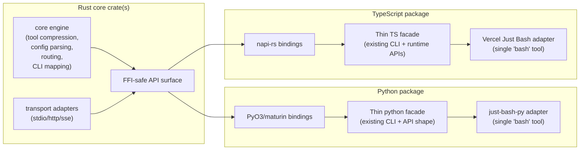

# Unified Rust Core Library Design (Draft)

## Problem

`mcp-compressor` now has both Python and TypeScript implementations. If core behavior continues to evolve independently, feature drift and maintenance cost will increase.

## Goals

Move core behavior into a shared Rust library, while keeping thin, idiomatic wrappers for Python and TypeScript.

For both language packages, preserve support for:

- all existing tool compression behavior
- JSON MCP configuration (single and multi-server)
- CLI mode for single and multi-server setups
- stdio MCP proxy-server operation
- direct in-process client/library usage (no stdio subprocess requirement)

Also add:

- TypeScript integration with Vercel Just Bash, exposing one `bash` tool that combines:
  - full Just Bash functionality
  - in-memory CLI access to one or more proxied MCP servers
- Python integration with `just-bash-py` (the Python package for Just Bash) with equivalent behavior

## Non-Goals (Initial Phase)

- rewriting FastMCP, MCP SDKs, or OAuth protocol internals in Rust
- replacing language-specific UX layers where idiomatic wrappers are preferred
- introducing behavior changes to compression semantics by default

## Proposed Architecture

## Rust Core Responsibilities

1. **Compression engine**
   - canonical tool listing compression for `low|medium|high|max`
   - schema lookup and invocation routing
   - include/exclude filtering
   - validation error enrichment
2. **Config + topology**
   - parse MCP config JSON for one or many servers
   - normalize server naming/prefix rules
3. **Proxy runtime primitives**
   - server registry and request routing
   - shared data models for tool/resource/prompt passthrough
4. **CLI-mode primitives**
   - command schema mapping
   - subcommand/flag translation
   - per-server in-memory CLI execution entrypoints
5. **Stable FFI layer**
   - versioned ABI/API boundary consumed by Python/TS wrappers

## Language Wrapper Responsibilities

### Python wrapper

- preserve current CLI UX and flags
- expose Python-native in-process client API backed by Rust runtime
- bridge to `just-bash-py`:
  - export one `bash` tool
  - include standard just-bash commands
  - add proxied MCP-server CLI commands as in-memory subcommands

### TypeScript wrapper

- preserve current TS CLI and runtime API ergonomics
- expose Node-native in-process client API backed by Rust runtime
- bridge to Vercel Just Bash:
  - export one `bash` tool
  - include standard Just Bash capabilities
  - add proxied MCP-server CLI commands as in-memory subcommands

## Just Bash Integration Model (Both Languages)

The language layer registers backend MCP servers as custom command providers. Each provider delegates execution to Rust:

1. parse user command and arguments
2. resolve target server/tool using Rust routing tables
3. invoke backend through Rust proxy runtime
4. return rendered output through Just Bash response conventions

This keeps command parsing and server-routing consistent across Python and TypeScript.

## Phased Delivery Plan

### Phase 0 — Contract and parity tests

- define canonical behavioral contract (compression outputs, schema retrieval, invocation, config parsing)
- add cross-language parity fixtures consumed by Python and TS tests

### Phase 1 — Rust core extraction

- implement compression/config/routing modules in Rust
- expose C-ABI-safe surface and high-level binding-friendly APIs

### Phase 2 — TypeScript migration

- replace TS core logic with Rust-backed bindings
- keep existing public API/CLI behavior stable
- add Just Bash single-tool integration

### Phase 3 — Python migration

- replace Python core logic with Rust-backed bindings
- keep existing public API/CLI behavior stable
- add `just-bash-py` single-tool integration

### Phase 4 — Hardening + rollout

- benchmark latency/token outputs versus current implementations
- complete docs/migration notes
- release behind optional feature flag first, then make default

## Risks and Mitigations

- **Binding complexity across two ecosystems**  
  Use mature tooling: `PyO3` + `maturin` (Python) and `napi-rs` (TypeScript).
- **Behavior regressions during migration**  
  Maintain parity fixtures and run language-level golden tests against shared scenarios.
- **Operational complexity from native artifacts**  
  Publish prebuilt wheels and Node binaries for major targets; keep a pure-language fallback path temporarily during migration.

## Open Questions

- Should OAuth token persistence remain language-side initially, or move to Rust once parity is proven?
- Do we need a strict semver contract for the Rust FFI layer, or can wrappers pin exact core versions early on?
- Should Just Bash integrations be optional package extras/features in the first release?
