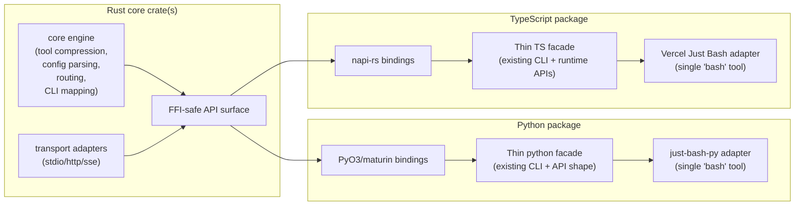

# Unified Rust Core Library Design (Draft)

## Problem

`mcp-compressor` now has both Python and TypeScript implementations. If core behavior continues to evolve independently, feature drift and maintenance cost will increase.

## Goals

Move core behavior into a shared Rust library and first-class Rust CLI binary, while keeping thin, idiomatic wrappers for Python and TypeScript.

For both language packages, preserve support for:

- all existing tool compression behavior
- JSON MCP configuration (single and multi-server)
- CLI mode for single and multi-server setups
- stdio MCP proxy-server operation
- direct in-process client/library usage (no stdio subprocess requirement)

Also add:

- TypeScript integration with Vercel Just Bash, exposing one `bash` tool that combines:
  - full Just Bash functionality
  - in-memory CLI access to one or more proxied MCP servers
- Python integration with `just-bash-py` (the Python package for Just Bash) with equivalent behavior

## Non-Goals (Initial Phase)

- rewriting FastMCP, MCP SDKs, or OAuth protocol internals in Rust
- replacing language-specific UX layers where idiomatic wrappers are preferred
- introducing behavior changes to compression semantics by default

## Proposed Architecture



## Rust Core Responsibilities

1. **Compression engine**
   - canonical tool listing compression for `low|medium|high|max`
   - schema lookup and invocation routing
   - include/exclude filtering
   - validation error enrichment
2. **Config + topology**
   - parse MCP config JSON for one or many servers
   - normalize server naming/prefix rules
3. **Proxy runtime primitives**
   - server registry and request routing
   - shared data models for tool/resource/prompt passthrough
4. **CLI-mode primitives**
   - command schema mapping
   - subcommand/flag translation
   - per-server in-memory CLI execution entrypoints
5. **Stable FFI layer**
   - versioned ABI/API boundary consumed by Python/TS wrappers

## Language Wrapper Responsibilities

### Python wrapper

- preserve current CLI UX and flags
- expose Python-native in-process client API backed by Rust runtime
- bridge to `just-bash-py`:
  - export one `bash` tool
  - include standard just-bash commands
  - add proxied MCP-server CLI commands as in-memory subcommands

### TypeScript wrapper

- preserve current TS CLI and runtime API ergonomics
- expose Node-native in-process client API backed by Rust runtime
- bridge to Vercel Just Bash:
  - export one `bash` tool
  - include standard Just Bash capabilities
  - add proxied MCP-server CLI commands as in-memory subcommands

## Just Bash Integration Model (Both Languages)

The language layer registers backend MCP servers as custom command providers. Each provider delegates execution to Rust:

1. parse user command and arguments
2. resolve target server/tool using Rust routing tables
3. invoke backend through Rust proxy runtime
4. return rendered output through Just Bash response conventions

This keeps command parsing and server-routing consistent across Python and TypeScript.

## Phased Delivery Plan

The Rust core and its language bindings are built **in parallel** with the existing Python implementation. There is no incremental migration or integration with legacy code during development — the new implementation is self-contained until it is ready to cut over. This prevents legacy patterns from influencing the Rust design.

### Phase 1 — Rust core (independent build)

Build the full Rust implementation as a standalone crate with no dependency on the existing Python package:

- `CompressedServer` — MCP client connection, `ToolCache`, `CompressionEngine`, stdio and streamable HTTP transports
- `ToolProxyServer` — generic HTTP proxy with bearer token auth and `POST /exec` dispatch
- First-class Rust CLI binary — directly usable without Python/TypeScript wrappers for normal compression mode, CLI mode, Just Bash mode, config-file input, and direct command input
- All client generators: `CliGenerator`, `PythonGenerator`, `TypeScriptGenerator`
- Self-contained Rust test suite covering compression, proxy, auth behaviour, and CLI executable e2e behaviour

### Phase 2 — Language bindings (independent build)

Build standalone language packages backed by the Rust core. No dependency on or modification of the existing Python package:

- **Python** — PyO3/maturin binding exposing `CompressedSession` and compression tools as native async Python; distributed as a separate wheel
- **TypeScript** — napi-rs binding exposing the same surface as a native Node.js module; distributed as a separate npm package

### Phase 3 — Cutover and hardening

Replace the existing implementations once the Rust-backed packages are production-ready:

- swap the Python `mcp-compressor` package to use the Rust-backed implementation
- swap the TypeScript package similarly
- benchmark latency and token output against the previous Python baseline
- complete docs and migration notes; release

## Risks and Mitigations

- **Binding complexity across two ecosystems**
  Use mature tooling: `PyO3` + `maturin` (Python) and `napi-rs` (TypeScript).
- **Behavior regressions during migration**
  Maintain parity fixtures and run language-level golden tests against shared scenarios.
- **Operational complexity from native artifacts**
  Publish prebuilt wheels and Node binaries for major targets; keep a pure-language fallback path temporarily during migration.
- **Future V8 isolate / WASM portability**
  `napi-rs` v3 provides an official WebAssembly path, but current support is centered on `wasm32-wasip1-threads` and still depends on host capabilities such as WASI, threads/Atomics, networking, and process adapters. Use `napi-rs` for the initial TypeScript binding, but keep public TS APIs and generated TS clients free of avoidable Node-native assumptions so a later WASM/V8-isolate target remains feasible.

## Implementation Progress

Status as of 2026-05-01, after the first Rust runtime implementation pass:

### Landed

- Rust workspace/crate scaffold exists at `crates/mcp-compressor-core`.
- Rust CI now runs the implemented Rust suite, not just compile checks:
  - `cargo check -p mcp-compressor-core`
  - Rust library tests
  - Rust integration tests for implemented runtime paths
  - FastMCP e2e tests for the Rust binary normal mode
  - compile-only coverage for all Rust integration targets
- Real MCP fixture servers exist for Rust runtime/e2e coverage:
  - `crates/mcp-compressor-core/tests/fixtures/alpha_server.py`
  - `crates/mcp-compressor-core/tests/fixtures/beta_server.py`
- Pure primitives are implemented:
  - compression levels and `CompressionEngine`
  - ordered JSON-schema parameter extraction
  - schema lookup/formatting
  - MCP config JSON parsing and server-name topology
  - CLI name mapping and JSON-schema-driven generated-command argv parsing
  - bearer session-token generation/verification
- Client generators are implemented and e2e-tested through the Rust proxy:
  - shell CLI script with legacy-style top-level/subcommand help
  - Python module
  - TypeScript ESM module plus declarations, using `fetch`
- `ToolCache` lazy fetch/refresh/invalidate/filter behavior is implemented.
- `CompressedServer` runtime is implemented for local stdio backends:
  - single-server direct command
  - multi-server direct command
  - single/multi-server MCP JSON config
  - wrapper tool routing for all compression levels
  - backend resource/prompt passthrough
- `CompressedServer` runtime is implemented for remote streamable HTTP backends:
  - automatic URL transport detection for `http://` and `https://`
  - explicit backend headers after `--`, using Python-compatible `Header=Value` syntax
  - `${VAR}` interpolation in backend header values
  - explicit auth-mode modelling: `auto`, `explicit-headers`, and `oauth`
  - native TLS enabled for HTTPS streamable HTTP backends
- Native OAuth groundwork is implemented:
  - file-backed `rmcp` credential/state stores
  - loopback callback listener
  - `rmcp::AuthorizationManager` / `AuthClient` wiring
  - persistent credential reuse when available
  - authorization URL startup path for interactive login
- Generic local HTTP proxy runtime is implemented:
  - `GET /health`
  - bearer-token-protected `POST /exec`
  - wrapper-style and generated-client direct dispatch
- Direct Rust CLI runtime is implemented:
  - normal stdio MCP frontend mode
  - normal streamable HTTP MCP frontend mode
  - CLI mode with generated shell command installed into a PATH-friendly location
  - Just Bash scaffold mode that starts the bridge and exposes the Just Bash tool surface
- Normal MCP frontend mode is implemented through `rmcp::ServerHandler`:
  - `tools/list` and `tools/call`
  - `resources/list` and `resources/read`
  - `prompts/list` and `prompts/get`
- FastMCP e2e coverage exists for the Rust binary normal mode with a real MCP client:
  - single-server fixture backend
  - multi-server direct and JSON config backends
  - streamable HTTP frontend
  - remote streamable HTTP backend fixture
  - tool schema lookup/invocation/listing
  - backend and compressor resources
  - prompt listing and prompt retrieval

### Known gaps and cleanup candidates

- **Top-level Rust CLI parsing is hand-rolled.** This is now complex enough that it should move to `clap` before more flags/modes are added. Keep the generated command argv parser (`cli/parser.rs`) separate because it is schema-driven and parses backend tool arguments, not the Rust binary's own options.
- **Native OAuth works as a first pass but should be simplified/hardened.** The current Rust code uses `rmcp` OAuth support plus local compressor callback/storage helpers. The next iteration should investigate replacing most custom callback/browser plumbing with `clio-auth`, while continuing to let `rmcp` own MCP OAuth protocol state and authorized HTTP transport.
- **Just Bash mode is a scaffold.** It starts the proxy and exposes `bash_tool` plus per-server help tools, but full Rust-native Just Bash AST execution remains TODO.
- **Legacy SSE backend support is not implemented.** `rmcp` 1.6.0 exposes SSE primitives for streamable HTTP, but no standalone legacy SSE client transport was identified. Revisit only if parity requires direct SSE backends or `rmcp` adds a public client transport.
- **Richer generated CLI help parity remains optional.** Current help is close to Python's top-level/subcommand shape, but argument descriptions, required/optional labels, type/default rendering, and edge-case formatting can still improve.
- **Python and TypeScript bindings/cutover remain TODO:**
  - PyO3/maturin package surface
  - napi-rs package surface
  - parity tests against legacy Python/TS behavior
- **WASM/V8-isolate strategy remains future design work, not an initial implementation target.**

### Recommended next implementation order

1. Refactor the Rust binary's top-level CLI parsing to `clap`.
2. Rework native OAuth around the cleanest combination of `rmcp` OAuth state/transport plus `clio-auth` for the local browser/callback UX.
3. Complete full Just Bash execution semantics or explicitly narrow/split the Just Bash MVP.
4. Add richer generated CLI help parity if manual testing shows meaningful gaps.
5. Begin Python and TypeScript bindings only after CLI/OAuth/Just Bash behavior is stable enough to avoid binding churn.

### Technical direction updates

#### Top-level Rust CLI: use `clap`

The Rust binary's top-level argument parsing is currently hand-rolled in `src/main.rs`. That was acceptable while the binary was only a scaffold, but it now supports normal mode, CLI mode, Just Bash mode, stdio/streamable HTTP frontend transports, direct command input, JSON config input, multi-server arguments, remote backend URL arguments, auth mode flags, and backend headers after `--`.

Move the Rust binary's own option parsing to `clap` before adding more flags. `clap`'s derive API supports typed parser structs, subcommands, value enums, flattened argument groups, generated help, and validation, which fits the static top-level CLI surface. Keep this separate from `cli/parser.rs`: that module parses generated-command arguments from backend tool JSON schemas and should remain schema-driven rather than `clap`-derived.

Design constraints for the `clap` refactor:

- Preserve the existing UX that all backend server arguments live after `--`.
- Preserve Python-compatible backend header syntax: `-H "Header=Value"` / `--header "Header=Value"` after the backend URL.
- Preserve `MCP_COMPRESSOR_EXIT_AFTER_READY=1` as a test escape hatch unless/until tests get a better process lifecycle hook.
- Use `ValueEnum`-style parsing for stable enums such as compression level, frontend transport, transform mode, backend config source, and backend auth mode.
- Keep generated shell/Python/TypeScript client argument parsing unchanged.

#### Native OAuth: combine `rmcp` protocol support with `clio-auth` UX plumbing

The current Rust OAuth implementation deliberately delegates MCP/OAuth protocol state to `rmcp`, using `AuthorizationManager`, `AuthClient`, and `rmcp` credential/state traits. However, the local browser/callback plumbing is custom code in `src/oauth.rs`.

Before expanding OAuth further, investigate simplifying that custom layer with `clio-auth`. `clio-auth` is designed for CLI/desktop OAuth Authorization Code with PKCE flows and provides the pieces `oauth2` does not: opening the browser and running a local web server for the authorization callback. That overlaps almost exactly with the custom callback listener and browser/user-prompt code we need for remote MCP servers.

The desired split is:

- `rmcp` remains responsible for MCP-specific OAuth metadata discovery, dynamic client registration, token exchange/refresh semantics, and authorized HTTP transport.
- `clio-auth` handles the local CLI UX pieces if it can be integrated cleanly: loopback listener, browser opening, callback parsing, user-facing success/error page.
- `mcp-compressor-core` owns only compressor-specific policy: token-store location, explicit `Authorization` header bypass behavior, clear errors, and parity with Python configuration semantics.

A follow-up spike against `clio-auth` 0.8.0 found that its public API is centered on an `oauth2::Client` and performs its own PKCE/state/callback flow; the lower-level callback server and browser-opening helpers are not exposed independently. That makes it a poor direct fit for the current `rmcp` integration, because using it would duplicate or bypass `rmcp`'s MCP-specific OAuth state machine. For now, prefer staying with `rmcp` and improving the small custom callback layer rather than adding `clio-auth` as an unused or conflicting dependency.

## Open Questions

- Should OAuth token persistence remain language-side initially, or move to Rust once parity is proven?
- Do we need a strict semver contract for the Rust FFI layer, or can wrappers pin exact core versions early on?
- Should Just Bash integrations be optional package extras/features in the first release?
- Which final WASM target/trampoline strategy, if any, should the TypeScript package support beyond initial `napi-rs` native builds?

---

## Normal Compression Mode: Simplified Core Architecture

### Problem with the Current Approach

The existing Python library implements compression as a FastMCP *middleware* layer (`CompressedTools`), which intercepts the underlying `list_tools`, `call_tool`, and related MCP protocol messages. While this works, it is hard to reason about: middleware sits between two protocol layers, has implicit ordering dependencies, and requires understanding FastMCP internals to extend or debug.

### Proposed Approach: Client → Compression Tools → Server

For the Rust core (and its language wrappers) the architecture is simpler and more explicit. There are exactly three layers with clear interfaces between them:

```
┌──────────────────────────────────┐
│   Backend MCP Server (upstream)  │
└──────────────┬───────────────────┘
               │ MCP protocol (stdio / http / sse)
┌──────────────▼───────────────────┐
│          Backend Client          │  ← one persistent MCP client connection
│   tool schema cache (RwLock)     │
└──────────────┬───────────────────┘
               │ in-process function calls
┌──────────────▼───────────────────┐
│       Compression Engine         │  ← pure functions, no I/O
│  format_listing(level, tools)    │
│  get_schema(name) → schema       │
│  invoke(name, input) → output    │
└──────────────┬───────────────────┘
               │ registered as 2–3 standard MCP tools
┌──────────────▼───────────────────┐
│       Frontend MCP Server        │  ← standard MCP server, no custom protocol
│   get_tool_schema / invoke_tool  │
│   list_tools  (max level only)   │
└──────────────┬───────────────────┘
               │ transport (caller's choice)
    ┌──────────┴──────────┐
    │ stdio (default)     │  streamable HTTP (127.0.0.1:<port>)
    └─────────────────────┘
```

The key insight: **the frontend MCP server does not know it is a proxy.** It is a plain MCP server with 2–3 registered tools. The tools happen to hold a reference to a backend client, but that is an implementation detail invisible to the protocol layer.

### CompressedServer

The top-level object is `CompressedServer`. In Rust it is a native struct; in Python it starts as a pure-Python class and becomes a PyO3/maturin binding to the Rust struct once the Phase 2 language bindings ship. The public API shape is identical in both cases — only the backing implementation changes.

`CompressedServer` owns:

- `backend` — a connected MCP client for the upstream server (using the official Rust MCP SDK)
- `cache` — `ToolCache`, lazily populated on first request, refresh-on-demand
- `engine` — `CompressionEngine`, a pure stateless value

```rust
pub struct CompressedServer {
    backend: Arc<McpClient>,      // official modelcontextprotocol/rust-sdk client
    cache:   Arc<RwLock<ToolCache>>,
    engine:  CompressionEngine,
    config:  CompressionConfig,   // level, include/exclude filters
}

impl CompressedServer {
    pub async fn connect(transport: impl IntoTransport) -> Result<Self>;

    /// Register compression tools on a new MCP server and run over stdio.
    pub async fn run_stdio(self) -> Result<()>;

    /// Register compression tools on a new MCP server and serve streamable HTTP.
    pub async fn run_http(self, addr: SocketAddr) -> Result<()>;

    /// In-process: call a backend tool directly, bypassing the MCP server layer entirely.
    pub async fn invoke(&self, tool: &str, input: Value) -> Result<ToolResult>;
}
```

**Python API (pure-Python initially; PyO3 binding later — same shape either way):**

```python
class CompressedServer:
    @classmethod
    async def connect(cls, command_or_url: str, **options) -> "CompressedServer": ...
    async def run_stdio(self) -> None: ...
    async def run_http(self, host: str = "127.0.0.1", port: int = 0) -> None: ...
    async def invoke(self, tool: str, input: dict) -> ToolResult: ...
```

### Tool Registration (No Middleware)

The 2–3 compression tools are registered on the frontend server as ordinary tool handlers that close over `backend` and `engine`:

```rust
fn register_compression_tools(server: &mut McpServer, state: Arc<CompressedServer>) {
    server.register_tool("get_tool_schema", {
        let s = state.clone();
        move |params| async move { s.get_schema(params.tool_name).await }
    });

    server.register_tool("invoke_tool", {
        let s = state.clone();
        move |params| async move { s.invoke(params.tool_name, params.input).await }
    });

    if state.config.level == CompressionLevel::Max {
        server.register_tool("list_tools", {
            let s = state.clone();
            move |_| async move { s.list_tools().await }
        });
    }
}
```

There is no middleware. The server's own tool list is exactly and only these 2–3 tools — the backend tool list is never surfaced to the protocol layer directly.

### Streamable HTTP Transport

Exposing the frontend server over streamable HTTP is a first-class transport option. This solves a real problem: **consuming mcp-compressor as a library without spawning a subprocess**.

With stdio, any caller that wants to embed mcp-compressor must either:
- spawn a subprocess and communicate over stdin/stdout, or
- use FastMCP-specific internals to embed the server in-process

With streamable HTTP, any caller that speaks MCP can connect over a local TCP socket:

```python
# Caller code — no subprocess, no FastMCP internals needed
async with CompressedServer.connect("uvx mcp-server-fetch") as cs:
    await cs.run_http(port=0)          # binds a free port, blocks until cancelled

# Elsewhere (same process or different):
async with McpClient(f"http://127.0.0.1:{cs.port}") as client:
    tools = await client.list_tools()
    result = await client.call_tool("invoke_tool", {...})
```

Or, if the caller just wants to drive the backend directly without any MCP client layer:

```python
async with CompressedServer.connect("uvx mcp-server-fetch") as cs:
    result = await cs.invoke("fetch", {"url": "https://example.com"})
```

The in-process `invoke` path bypasses the MCP server entirely — there is no network round-trip.

### Is This Architecture Sound?

Yes, with the following notes:

**What is simpler:**
- No middleware — just a client, a stateless engine, and a server. Each layer is independently testable.
- Transport choice (stdio vs HTTP) is a single parameter, not a structural change.
- In-process `invoke` enables zero-overhead library usage.

**What is intentionally different from the current Python implementation:**
- Resources and prompts from the backend **are** forwarded to the frontend server as-is. Only tools get the compression treatment: the full upstream tool list is hidden and replaced with the 2–3 compressed wrapper tools. Resources and prompts pass through transparently, preserving the full MCP surface for callers that need them.
- The tool schema cache is explicit (`RwLock<ToolCache>`) rather than implicit in the middleware call chain. This makes cache invalidation and refresh observable.

**Concurrency:**
Concurrency is handled entirely by the official [Rust MCP SDK](https://github.com/modelcontextprotocol/rust-sdk). `CompressedServer` delegates all transport-level concurrency to the SDK's server and client implementations; no custom concurrency primitives are required beyond the `RwLock<ToolCache>` that guards the tool schema cache.

**Language-native function imports (preferred library usage pattern):**

Rather than routing through the streamable HTTP server, the compression tools can be exposed as ordinary importable functions in each language binding. This is the preferred pattern for same-process library use: no network round-trip, no MCP client protocol overhead, and no spawned subprocess.

The key question is: *how does the backend client get passed around?* The answer is a `CompressedSession` context manager that holds the connected backend client as shared state. The language-specific binding functions capture a reference to it:

```python
# Python — language-native import pattern
async with CompressedSession.connect("uvx mcp-server-fetch") as session:
    # Each compression tool is a plain async function bound to this session.
    # The backend client is held inside `session`; callers never touch it directly.
    schema = await session.get_tool_schema("fetch")
    result = await session.invoke_tool("fetch", {"url": "https://example.com"})
    tools  = await session.list_tools()          # max compression level only
```

The TypeScript binding follows the same pattern:

```typescript
// TypeScript — language-native import pattern
await using session = await CompressedSession.connect("uvx mcp-server-fetch");
const schema = await session.getToolSchema("fetch");
const result = await session.invokeTool("fetch", { url: "https://example.com" });
```

In the PyO3 binding phase, `CompressedSession` is a thin Python object that holds a reference to the Rust `CompressedServer`. The individual functions (`get_tool_schema`, `invoke_tool`, `list_tools`) are `#[pymethods]` that dispatch into the Rust async runtime via `pyo3-asyncio`. The backend client lives entirely on the Rust side — Python callers never need to manage it.

Streamable HTTP remains useful for cross-language and cross-process consumers, but for same-language library use the session-bound function API is simpler and faster.

### Code Organization for Compression Mode

The compression-mode modules in the Rust crate:

```
crates/mcp-compressor-core/src/
├── server/
│   ├── mod.rs
│   ├── compressed.rs        # CompressedServer: connect, run_stdio, run_http, invoke
│   ├── tool_cache.rs        # ToolCache: fetch-once, refresh, include/exclude filter
│   └── registration.rs      # register_compression_tools(server, state)
├── compression/
│   ├── mod.rs
│   ├── engine.rs            # CompressionEngine: format_listing, get_schema (pure)
│   └── levels.rs            # CompressionLevel enum and per-level formatters
└── transport/
    ├── mod.rs
    └── factory.rs           # infer transport type from command/URL; build client transport
```

And in the Python package (the current `tools.py` middleware is replaced by a thin wrapper around `CompressedServer`):

```
mcp_compressor/
├── server.py                # CompressedServer (Python wrapper or PyO3 binding)
│                            #   connect(), run_stdio(), run_http(port), invoke()
├── engine.py                # CompressionEngine (pure functions, or binding)
└── tool_cache.py            # ToolCache (fetch, refresh, filter)
```

`tools.py` (the current `CompressedTools` middleware) is superseded by `server.py`. The public CLI flags and compression semantics are unchanged.

---

## Extended Design: Generic Tool Proxy and Multi-Target Client Generation

### Motivation

The current CLI mode hardwires the local HTTP bridge to a single output format: a shell script (Unix or Windows `.cmd`).
The proxy itself and the generated client are tightly coupled, which prevents reuse.

By separating the **generic tool proxy** from the **client generator**, we can use the same proxy for any generated client artifact:

- shell CLI scripts (current behaviour)
- Python library modules
- TypeScript / Node.js modules

All three patterns follow the same runtime contract:

1. Start the local tool proxy with a freshly generated bearer token.
2. Generate the client artifact with the token hardcoded.
3. The client artifact calls `POST /exec` with `Authorization: Bearer <token>`.
4. The proxy validates the token and dispatches the tool call.

This mirrors how Jupyter Notebook generates a one-time token at startup and embeds it in the server URL — the token is an opaque secret that scopes each server session.

---

### Generic Tool Proxy

The local tool proxy is a minimal HTTP server that:

- listens on `127.0.0.1:<port>` (random free port by default)
- generates a cryptographically random session token at startup (e.g. `secrets.token_hex(32)`)
- requires `Authorization: Bearer <token>` on every request (except `GET /health`)
- exposes two endpoints:

| Method | Path      | Description                                      |
|--------|-----------|--------------------------------------------------|
| GET    | /health   | liveness check (no auth required)                |
| POST   | /exec     | accept `{"tool": "<name>", "input": {...}}` body |

The token is printed to stderr at startup (informational only) and is embedded at generation time into every client artifact that is produced for that session.

Token validation must be constant-time to avoid timing side-channels.

#### Why a bearer token?

- The proxy only binds to loopback, so network exposure is already limited.
- A bearer token prevents any other local process (or stale script from a previous session) from calling the proxy unintentionally.
- It matches the familiar Jupyter pattern, which is well understood by practitioners.
- Stale scripts from previous sessions simply fail to authenticate; they do not silently call the wrong backend.

---

### Client Generator Architecture

The `ClientGenerator` trait / abstract class produces one or more artifact files from the same inputs:

```
ClientGenerator.generate(
    cli_name: str,
    bridge_url: str,      # e.g. "http://127.0.0.1:51234"
    token: str,           # session bearer token, hardcoded into artifact
    tools: list[Tool],
    session_pid: int,
    output_dir: Path,
) -> list[Path]           # paths of generated artifact files
```

Three built-in generators ship with the initial implementation:

| Generator        | Artifact(s)                                          | Notes                                    |
|------------------|------------------------------------------------------|------------------------------------------|
| `CliGenerator`   | `<cli_name>` (Unix) / `<cli_name>.cmd` (Windows)    | current behaviour, adapted to use token  |
| `PythonGenerator`| `<cli_name>.py`                                      | importable module + `__main__` entry     |
| `TypeScriptGenerator` | `<cli_name>.ts` + `<cli_name>.d.ts`           | ESM module, one function per tool        |

All generators receive the same token and embed it as a constant in the generated artifact.

---

### Bearer Token in the Proxy Server

**Rust side (`proxy/auth.rs`):**

```
pub struct SessionToken(String);

impl SessionToken {
    pub fn generate() -> Self { /* rand::random::<[u8; 32]>().hex() */ }
    pub fn verify(&self, header: &str) -> bool { /* constant-time compare */ }
}
```

**Python side (`proxy/auth.py`):**

```python
import secrets, hmac

class SessionToken:
    def __init__(self) -> None:
        self._token = secrets.token_hex(32)

    @property
    def value(self) -> str:
        return self._token

    def verify(self, header: str | None) -> bool:
        if header is None:
            return False
        expected = f"Bearer {self._token}"
        return hmac.compare_digest(expected, header)
```

The proxy server middleware checks the token before routing any `POST /exec` request and returns `HTTP 401` on mismatch.

---

### Generated Client Artifacts

#### CLI script (adapted from current behaviour)

The generated shell script gains a `TOKEN` constant and includes it in every request:

```python
TOKEN = "a3f7...deadbeef"   # hardcoded at generation time

req = urllib.request.Request(
    bridge + "/exec",
    data=payload,
    headers={
        "Content-Type": "application/json",
        "Authorization": f"Bearer {TOKEN}",
    },
    method="POST",
)
```

#### Python library module

`<cli_name>.py` is a self-contained importable module. Each upstream tool becomes a typed Python function:

```python
# generated by mcp-compressor — do not edit manually
import httpx

_BRIDGE = "http://127.0.0.1:51234"
_TOKEN  = "a3f7...deadbeef"
_HEADERS = {"Authorization": f"Bearer {_TOKEN}"}

def get_confluence_page(page_id: str, *, space_key: str | None = None) -> str:
    """Retrieve a Confluence page by ID."""
    resp = httpx.post(
        f"{_BRIDGE}/exec",
        json={"tool": "get_confluence_page", "input": {"page_id": page_id, "space_key": space_key}},
        headers=_HEADERS,
    )
    resp.raise_for_status()
    return resp.text
```

This allows any Python code (or an LLM-driven agent) to `import <cli_name>` and call backend MCP tools as ordinary functions, without running an MCP client.

#### TypeScript / Node.js module

`<cli_name>.ts` is a typed ESM module. Each tool becomes an exported async function:

```typescript
// generated by mcp-compressor — do not edit manually
const BRIDGE = "http://127.0.0.1:51234";
const TOKEN  = "a3f7...deadbeef";
const HEADERS = { Authorization: `Bearer ${TOKEN}`, "Content-Type": "application/json" };

export async function getConfluencePage(pageId: string, spaceKey?: string): Promise<string> {
  const res = await fetch(`${BRIDGE}/exec`, {
    method: "POST",
    headers: HEADERS,
    body: JSON.stringify({ tool: "get_confluence_page", input: { page_id: pageId, space_key: spaceKey } }),
  });
  if (!res.ok) throw new Error(await res.text());
  return res.text();
}
```

An accompanying `<cli_name>.d.ts` declaration file is generated for projects that consume the module without bundling.

#### Future V8 isolate / WASM compatibility guidance

The initial TypeScript package can use `napi-rs` and ship as a native Node.js module. Current `napi-rs` v3 releases also provide an official WebAssembly path, with the practical default centered on `wasm32-wasip1-threads`. That is encouraging for future browser/StackBlitz/Node-WASM fallback scenarios, but it does not automatically guarantee compatibility with every V8-isolate host. Isolate viability will still depend on the host's support for WASI, threads/Atomics, networking/fetch, timers, and any process-spawning or local-listener capabilities we require. We do not need to implement the WASM path initially, but the design should avoid choices that make it unnecessarily hard later.

Guidance for TypeScript-facing APIs and generated TypeScript artifacts:

- Prefer Web-standard APIs where possible: `fetch`, `Request`, `Response`, `Headers`, `URL`, `TextEncoder`, `TextDecoder`, `AbortSignal`, `ReadableStream`.
- Avoid exposing Node-native types in public APIs: `Buffer`, `fs` paths, `net.Socket`, `http.ClientRequest`, `stream.Readable`, `EventEmitter`, and Node-specific timer/process handles.
- Keep filesystem, process spawning, environment-variable access, and local TCP listener startup behind narrow runtime adapters. These are fine for the Node/napi implementation, but should not leak into the stable TS API shape.
- Keep generated TypeScript client modules dependency-light and ESM-first. They should call the local proxy through `fetch` rather than `node:http`, `axios`, or other Node-only clients.
- Keep data crossing the Rust/TS boundary JSON-serializable: strings, numbers, booleans, arrays, objects, and byte data represented explicitly rather than as `Buffer`.
- Avoid global mutable Node process state in generated clients. Multi-session bridge selection should be representable as explicit configuration, not only as `process.env` or process-global registries.
- Separate runtime capability detection from core behavior. The Node package may provide adapters for spawning MCP servers and starting loopback proxies; a future isolate/WASM package may require callers to inject transport/proxy capabilities instead.
- Keep Rust core logic that is pure or protocol-level separate from OS-bound code. That makes it easier to compile compression, schema, CLI mapping, and generated-client logic to a WASM target later while leaving stdio/process/local-network transports as host-provided adapters.

Non-goals for the initial `napi-rs` implementation:

- shipping a WASM package or selecting a final WASM target/trampoline strategy
- supporting MCP stdio child-process spawning inside isolates
- supporting local TCP proxy startup inside isolates

The main requirement today is API discipline: Node-native behavior is allowed internally for the Node binding, but public TypeScript surfaces should remain portable enough that a future WASM/V8-isolate implementation can reuse the same high-level API.

---

### Multi-session Support

The same multi-session BRIDGES map used in the current CLI scripts is extended to all generators:

```
BRIDGES = {
    <session_pid>: {"url": "http://127.0.0.1:<port>", "token": "<token>"},
    ...
}
```

Because each bridge entry now carries its own token, generated artifacts from different sessions cannot interfere with one another even if a stale artifact is left on disk.

---

### Code Organization Map

#### Rust crate (`crates/mcp-compressor-core/`)

```
crates/mcp-compressor-core/
└── src/
    ├── lib.rs                   # public re-exports; crate feature flags
    ├── main.rs                  # Rust CLI binary entrypoint
    ├── compression/
    │   ├── mod.rs
    │   ├── engine.rs            # tool listing compression for low|medium|high|max
    │   └── levels.rs            # CompressionLevel enum and per-level formatters
    ├── config/
    │   ├── mod.rs
    │   └── topology.rs          # MCPConfig parse, server naming, prefix rules
    ├── proxy/
    │   ├── mod.rs
    │   ├── server.rs            # generic tool proxy HTTP server
    │   ├── auth.rs              # SessionToken: generate, verify (constant-time)
    │   ├── router.rs            # request routing: /health, /exec
    │   └── registry.rs          # server registry and multi-server routing
    ├── client_gen/
    │   ├── mod.rs
    │   ├── generator.rs         # ClientGenerator trait (generate → Vec<PathBuf>)
    │   ├── cli.rs               # CliGenerator  → shell script (.sh / .cmd)
    │   ├── python.rs            # PythonGenerator → <name>.py module
    │   └── typescript.rs        # TypeScriptGenerator → <name>.ts + .d.ts
    ├── cli/
    │   ├── mod.rs
    │   ├── mapping.rs           # tool_name_to_subcommand, sanitize_cli_name
    │   └── parser.rs            # argv → tool_input (JSON Schema-driven)
    └── ffi/
        ├── mod.rs
        └── types.rs             # FFI-safe structs and C-ABI surface
```

#### Python package (`mcp_compressor/`)

```
mcp_compressor/
├── main.py                      # CLI entry point (unchanged public API)
├── tools.py                     # CompressedTools middleware (unchanged)
├── types.py                     # CompressionLevel, LogLevel, TransportType
├── cli_tools.py                 # tool_name_to_subcommand, parse_argv, help text
├── logging.py                   # configure_logging, OAuth traceback suppression
├── oauth.py                     # OAuth token persistence helpers
├── banner.py                    # startup banner
├── proxy/
│   ├── __init__.py
│   ├── server.py                # ToolProxyServer (replaces CliBridge)
│   │                            #   - binds 127.0.0.1:<port>
│   │                            #   - generates SessionToken at startup
│   │                            #   - validates Bearer token on /exec
│   │                            #   - routes /health and /exec
│   └── auth.py                  # SessionToken (generate, constant-time verify)
└── client_gen/
    ├── __init__.py
    ├── base.py                  # ClientGenerator ABC: generate() → list[Path]
    ├── cli.py                   # CliGenerator (replaces cli_script.py)
    │                            #   - Unix shebang script + Windows .cmd
    │                            #   - BRIDGES map with {pid: {url, token}}
    ├── python_lib.py            # PythonGenerator
    │                            #   - one function per tool, typed signatures
    │                            #   - httpx-based, token in module constant
    └── typescript_lib.py        # TypeScriptGenerator
                                 #   - ESM async functions, typed with TS interfaces
                                 #   - fetch-based, .ts + .d.ts output
```

`CliBridge` and `cli_script.py` are superseded by `proxy/server.py` and `client_gen/cli.py` respectively.
The public CLI flags (`--cli-mode`, `--cli-port`) and all existing behaviour are preserved.

#### Rust CLI binary

The Rust core crate should also ship a directly usable CLI executable. This binary is not just a development harness; it is a supported entrypoint for users who want the Rust implementation without the Python or TypeScript wrappers.

The Rust CLI should support the same high-level modes as the wrappers:

- normal compressed MCP server mode
- CLI mode / generated-client proxy mode
- Just Bash mode
- single-server direct command input, e.g. `mcp-compressor-core -- uvx mcp-server-fetch`
- single-server and multi-server MCP config JSON input
- stdio and streamable HTTP frontend transports where applicable

The Rust CLI e2e test suite should invoke the compiled binary with real fixture MCP servers and assert observable behavior, including:

- `--help` and invalid-argument output
- all compression levels
- all proxy transform modes
- single-server direct command config
- single-server JSON config
- multi-server JSON config
- expected wrapper tool names and tool invocation output
- resources/prompts passthrough once the runtime supports them

These tests are distinct from library-level Rust integration tests. Library tests prove the Rust API works; CLI e2e tests prove the packaged executable, argument parsing, process lifecycle, stdout/stderr behavior, and exit codes work.

#### TypeScript package (`typescript/`)

```
typescript/
├── src/
│   ├── index.ts                 # public exports
│   ├── proxy/
│   │   ├── server.ts            # ToolProxyServer (HTTP, token auth)
│   │   └── auth.ts              # SessionToken
│   └── client_gen/
│       ├── base.ts              # ClientGenerator interface
│       ├── cli.ts               # CliGenerator (shell script)
│       ├── pythonLib.ts         # PythonGenerator
│       └── typescriptLib.ts     # TypeScriptGenerator
└── README.md
```
